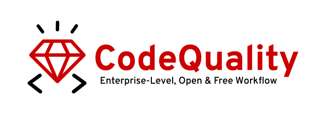
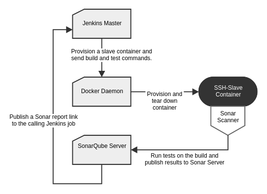

  

The following document introduces the my perspective on the integration of SonarQube and it's role within the code quality tool-set from **my experiences as a solutions architect, designing a code quality metric infrastructure at RedHat for the past 2 years.** Here you will find the project summary, compatibility matrix, workflows and additional reading materials on specific subjects.

## Objective

We aimed to build a high quality, enterprise-wide code quality monitoring system. Enabling senior managers to prioritize projects more precisely, aiding project managers to focus their development efforts better and guiding developers through complexity, vulnerability and testability issues by aiming to centralize every project's quality metrics and issues, providing each project with all of the standard code quality metrics and presenting this information in a differential representation on several levels of fidelity – from a developer's view to a manager's.

## Documentation

- [**SoanrQube Platform**](https://www.sonarqube.org/)
- [**Code Quality Management**](documentation/management)
- **Language & Platform Specific Analysis**
  - [Ruby Quality Analysis](documentation/ruby)
  - [Java Quality Analysis](documentation/java)
  - [Python Quality Analysis](documentation/python)
  - [C/C++ Quality Analysis](documentation/cpp)
- [**SonarQube Deployment**](deployments)

## Compatability Matrix

The following matrix illustrates the current tested monitoring and reporting capabilities of the CodeQuality project for specific project languages

Language / Metric  | Code Coverage  | Static Analysis  | Jenkins Automation  | Jenkins Publishing  | SonarQube Publishing
--|---|---|---|---|--
**Java**  | ✔  | ✔  | ✔  | ✔  | ✔
**Ruby**  | ✔  | ✔  | ✔  | ✔  | ✔
**C/C++**  | ✔  | ✖  | ✔  | ✔  | ✔
**Python**  | ✔  | ✔  | ✔  | ✔  | ✔

## Implemetation Time Assessment

It is difficult to estimate the time your project will require without knowing the details of your environment. It is suggested that you view the documentation provided and determine if it fits with the way your project works. If it appears to you that following the documentation will provide you what you need the effort should be on the order of one to a couple weeks.

## Testing Environment

All supported functionality and plug-ins are being tested on a testing and CI environment build upon the following structure.

The following components are:

- **Jenkins Master**
  used for running and managing workflow verification tests as well as plug-in integration and unit tests

- **SonarServer**
  used to collect test results from the tested workflows and testing reporting configurations

- **Docker Daemon**
  used for testing environment provisioning

### Machine Environment

All machines are held on an OpenStack server
with a `4.6.7-200.fc23.x86_64, python v2.7` image.

### Working Versions

Jenkins Master - v2.60.3
Docker Daemon - v1.9.0, build 76d6bc9
Sonar Server - v6.7 LTS [(Installation Instructions)](deployments)
Sonar Scanner - v2.8

## Contributing

We are super happy to recieve more documentation and new tooling methods you are using to make this project as useful as we could so please read the [CONTRIBUTING.md](./CONTRIBUTING.md) for details on our code of conduct, and the process for submitting pull requests to us (:

## License

This project is licensed under the GPL v3[(hehe)](http://www.relatably.com/m/img/open-source-meme-generator/61456596.jpg) - see the [LICENSE.md](./LICENSE.md) file for more details

## Super Special Thanks
I'd like to give million thanks to [Alex Braverman](https://github.com/abraverm) who've been with me this entire process and made this pain-stakingly long process bearable with amounts of dark humor this world is yet ready to recieve.
I also wanna thank the fabulous [Jared Wilkerson](https://github.com/lyrch) who carried and is still carrying through with finishing some final touches on the visualization parts of this project and the awesome person he is in general.
Finally and of course, great credit goes to the entire RedHat community for being such and inspiring people to follow in their footsteps.
