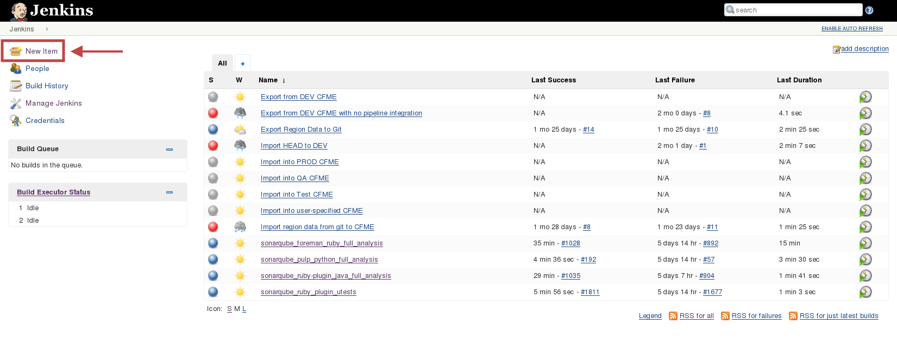
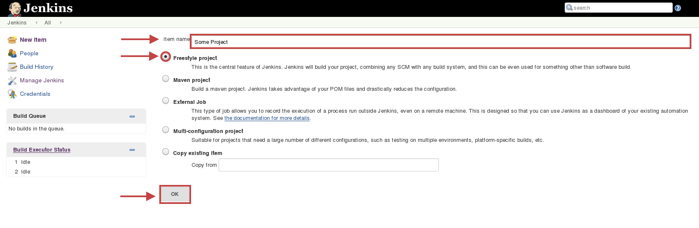
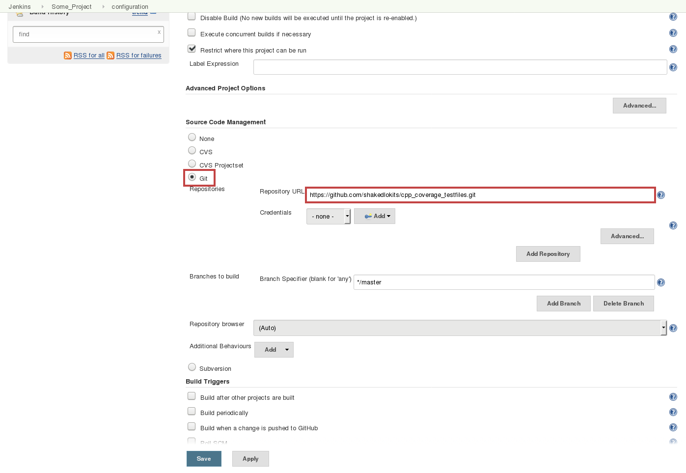
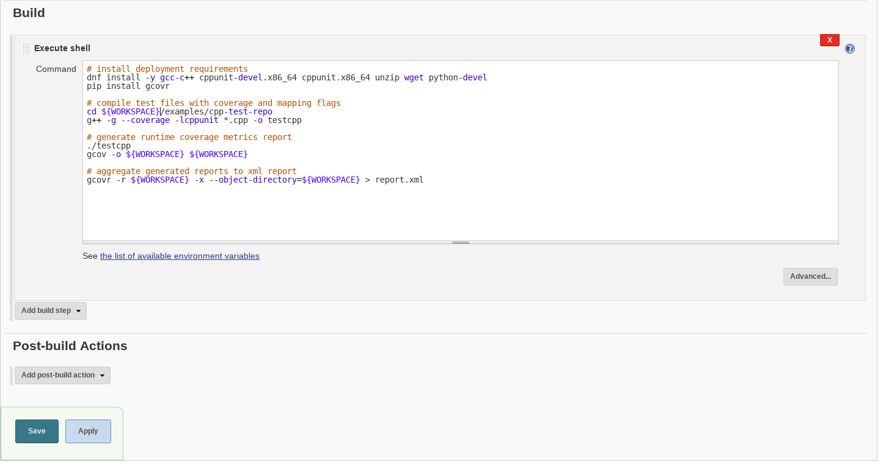
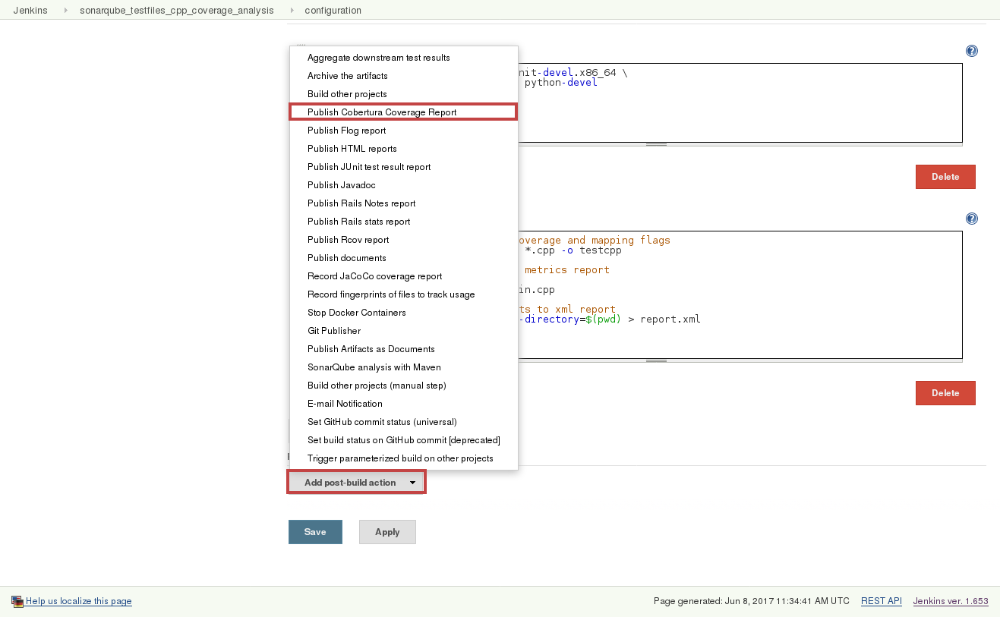
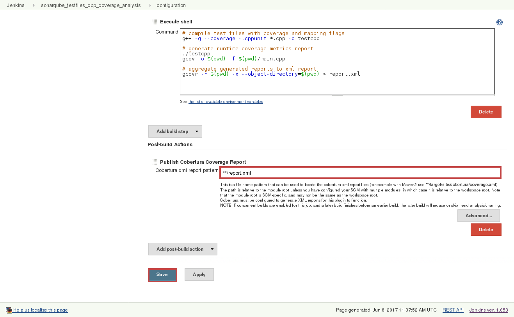
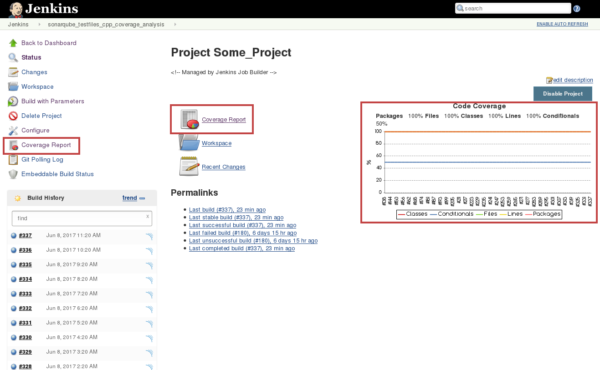
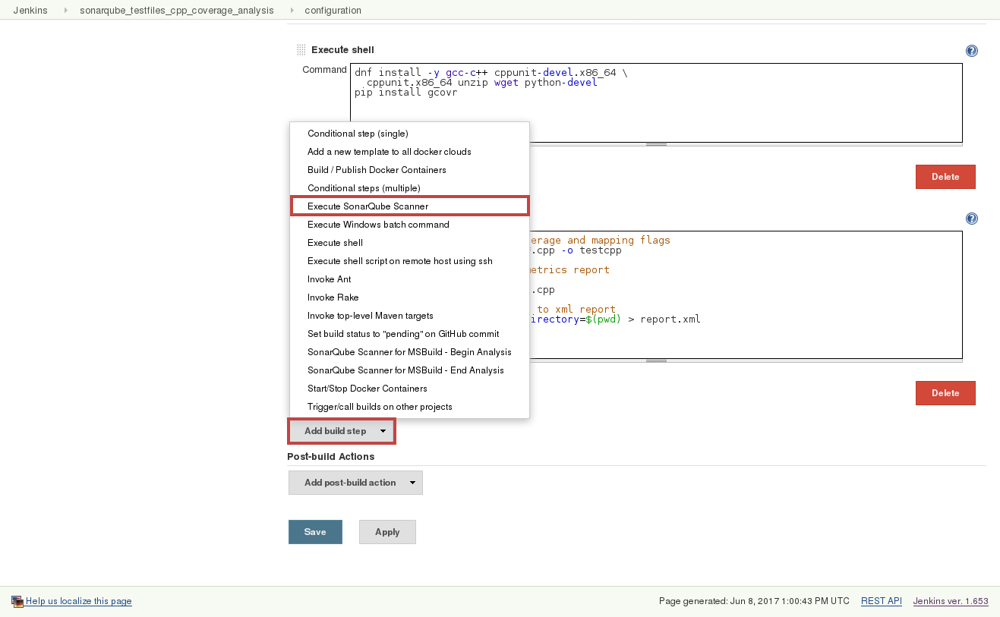
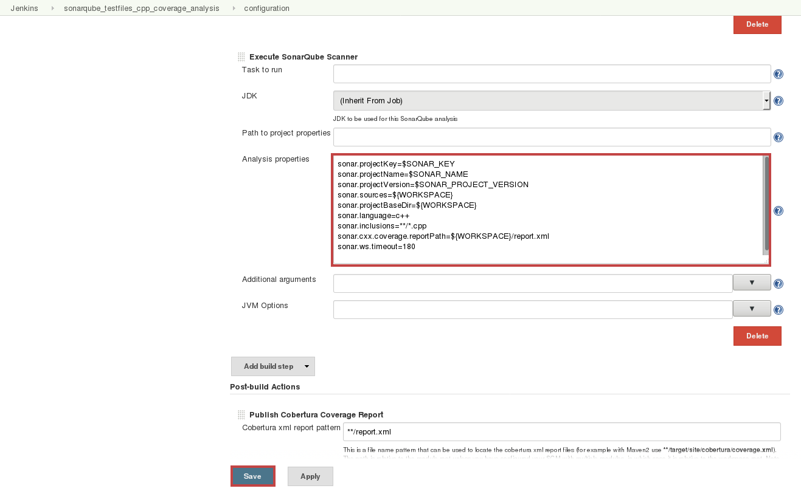
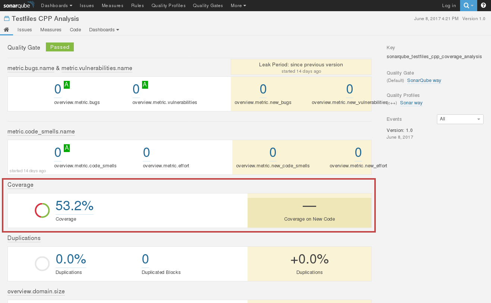

# C/C++ Code Coverage

The following document goes through running code coverage for c/c++, automation with Jenkins and integration with SonarQube. The code coverage tool to be used for c/c++ is [gcov](https://gcc.gnu.org/onlinedocs/gcc/Gcov.html). Formatting and aggregation is managed with [gcovr](http://gcovr.com/).

This document is separated into 3 parts:

- **Manual Coverage** - section will present you the supported method of running code coverage on python.
- **Jenkins Automation** - section will introduce the basic steps in order to automate the coverage process using the web UI.
- **SonarQube Integration** - section will teach you how to publish your results to SonarQube using the Jenkins web UI as well as manually.

> ⚔ Note: Additional advanced topics such as covering services for integration tests or JJB configuration are covered at the bottom of the document under the **Advanced Topics** section.

## Table of Contents

<!-- TOC depthFrom:1 depthTo:4 withLinks:1 updateOnSave:1 orderedList:0 -->

- [C/C++ Code Coverage](#cc-code-coverage)
	- [Table of Contents](#table-of-contents)
	- [Manual Coverage](#manual-coverage)
		- [Prerequisites](#prerequisites)
		- [Running code coverage manually](#running-code-coverage-manually)
			- [Example](#example)
	- [Jenkins Automation](#jenkins-automation)
		- [Prerequisites](#prerequisites)
		- [Automating using the web UI](#automating-using-the-web-ui)
			- [Example](#example)
		- [Uploading coverage results to Jenkins](#uploading-coverage-results-to-jenkins)
			- [Example](#example)
	- [SonarQube Integration](#sonarqube-integration)
		- [Prerequisites](#prerequisites)
		- [Integrating SonarQube through the Jenkins web UI](#integrating-sonarqube-through-the-jenkins-web-ui)
			- [Example](#example)
		- [Publishing to SonarQube manually](#publishing-to-sonarqube-manually)
			- [Example](#example)
	- [Advanced Topics](#advanced-topics)
		- [Covering services](#covering-services)
			- [Prerequisites](#prerequisites)
			- [Implementation steps](#implementation-steps)
		- [Jenkins Job Builder](#jenkins-job-builder)
			- [Prerequisites](#prerequisites)
			- [Example](#example)

<!-- /TOC -->


 --------------------------------------------------------------------------------

## Manual Coverage

### Prerequisites

- python 2.7+
- g++ (GCC) v6.3.1+
- [gcov v6.3.1+](https://gcc.gnu.org/onlinedocs/gcc/Gcov.html) (supplied with GCC packages)
- [gcovr v3.3+](http://gcovr.com/)

> ⚔ Note: notice there are several methods and tools to run code coverage such as [BullseyeCoverage](http://www.bullseye.com/productInfo.html), [GCT](http://www.exampler.com/testing-com/tools.html) and [COVTOOL](http://covtool.sourceforge.net/).
> we will only introduce one way of going about it which we have concluded to be the most suitable and straightforward for this process.

### Running code coverage manually

1. compile your project including the mapping and coverage flags `g++ -g --coverage <project files> -o <output file>`

    > ⚔ Note: we included the **-g** mapping flag which adds line numbers to the output and the **--coverage** flag which instruments the output. If you are compiling C using **gcc**, you'd use **-fprofile-arcs -ftest-coverage** instead of **--coverage**.

2. run the compiled executable in order for the instrumented program to generate run-time logs

3. generate coverage reports from the run-time logs using **gcov**
`gcov -o <reports target directory> <source files directory>`

    > ⚔ Note: in most cases, both the reports and source file directory should be the same directory.

4. aggregate generated file coverage report into a single project coverage XML report using **gcovr**
`gcovr -r <source files root directory> -x --object-directory=<gcov reports directory> > report.xml`

	> ⚔ Note: we included the **-r** flag to signify the following path is the **root** path and the **-x** flag to indicate the expected output is XML.

  > ⚔ Note: The generated report will be in [Cobertura](http://cobertura.github.io/cobertura/) format as **required**, in order to be processed by SonarQube.

#### Example

Let's assume you have the following C++ files:

- **main.cpp**

  ```c++
	#include "main.h"

	/**
	 * our basic function
	 * @param name the name of our friend
	 * @return greeting for our friend
	 */
	string testMe(string name) {
	    return "Hello " + name + "!";
	}
  ```

- **main.h**

  ```c++
	#ifndef TESTCPP_MAIN_H
	#define TESTCPP_MAIN_H

	#include <iostream>

	using namespace std;

	// declaring our tested function
	string testMe(string name);

	#endif //TESTCPP_MAIN_H
  ```

- **tests.cpp**

  ```c++
	#include <cppunit/TestCase.h>
	#include <cppunit/ui/text/TextTestRunner.h>
	#include <cppunit/extensions/HelperMacros.h>
	#include <cppunit/TestResult.h>
	#include <cppunit/TestResultCollector.h>
	#include <cppunit/BriefTestProgressListener.h>
	#include <cppunit/CompilerOutputter.h>
	#include <cppunit/XmlOutputter.h>

	#include "main.h"

	using namespace CppUnit;

	class HelloWorldTest : public CppUnit::TestFixture  {
	public:

	    void test()
	    {
	        CPPUNIT_ASSERT( testMe("Bob").compare("Hello Bob!") == 0 );
	    }
	};

	int main(int argc, char* argv[]) {
	    CppUnit::TestCaller<HelloWorldTest> test( "test", &HelloWorldTest::test );
	    CppUnit::TestResult result;
	    test.run( &result );
	}
  ```

> ⚔ Note: [CppUnit](https://sourceforge.net/projects/cppunit/) is required in order to run these tests.

1. run the command `g++ -g --coverage -lcppunit *.cpp -o testcpp` to compile the project with coverage and line mapping

	> ⚔ Note: we linked [CppUnit](https://sourceforge.net/projects/cppunit/) statically using **-lcppunit**.

2. run our compiled executable `./testcpp` in order to generate our run-time **.gcda/.gcno** log files

3. execute **gcov** by running `gcov -o $(pwd) $(pwd)` in order to generate file coverage reports from our logging files

4. finally, run **gcovr** with `gcovr -r $(pwd) -x --object-directory=$(pwd) > report.xml` in order to aggregate our generated file coverage reports into a singular XML report.

you can now find our generated **report.xml** report file in the working directory and we are done! (:

--------------------------------------------------------------------------------

## Jenkins Automation

### Prerequisites

- [Jenkins v1.653+](https://jenkins.io/)
- [Cobertura plugin v1.9.8+](https://wiki.jenkins-ci.org/display/JENKINS/Cobertura+Plugin)
- testing environment running:

  - fedora v23
  - Java v8+
  - git

  > ⚔ Note: you could either use a provisioning system such as [docker daemon](https://docs.docker.com/engine/reference/commandline/dockerd/), [OpenShift](https://github.com/openshift), [OpenStack](https://github.com/openstack), [Kubernetes](https://kubernetes.io/), etc. or use a local environment.

> ⚔ Note: notice there are several methods and tools to manage CI and automation such as [Gump](https://gump.apache.org/), [Hudson](http://hudson-ci.org/), [Bamboo](https://www.atlassian.com/software/bamboo), [Travis](https://travis-ci.org/) and more. We will only introduce and support Jenkins for this end as it is the standardized CI tool in RedHat.

### Automating using the web UI

Continuing from the previous chapter, assuming our project files are held on a remote github repository **[https://github.com/RedHatQE/CodeQuality.git](https://github.com/RedHatQE/CodeQuality.git)**.

#### Example

1. in the main Jenkins page, click to `New Item` button to create a new job

    

2. name your job, select the `Freestyle Project` radio button and save the new job

    

3. on the newly opened screen, set the SCM to git and paste in our repository
		```plain
		https://github.com/RedHatQE/CodeQuality.git
		```

    

4. scroll down and create a new bash script build step

    

5. paste the following deployment script onto the bash text editor

    ```shell
   # install deployment requirements
	 dnf install -y gcc-c++ cppunit-devel.x86_64 cppunit.x86_64 unzip wget python-devel
	 pip install gcovr

	 # compile test files with coverage and mapping flags
	 cd ${WORKSPACE}/examples/cpp-test-repo
	 g++ -g --coverage -lcppunit *.cpp -o testcpp

	 # generate runtime coverage metrics report
	 ./testcpp
	 gcov -o ${WORKSPACE} ${WORKSPACE}

	 # aggregate generated reports to xml report
	 gcovr -r ${WORKSPACE} -x --object-directory=${WORKSPACE} > report.xml
    ```

    > ⚔ Note: the **-y** parameter in the dnf command approves installation prompts which is mandatory for automation purposes.

    > ⚔ Note: the **${WORKSPACE}** environment variable is used by Jenkins in order to point to the current build's working directory

    

    let's have a look for a moment at our script, we can see it's divided into 3 main parts:

    - installation of prerequisites
    - running our tests with coverage to create file reports (as seen on the previous chapter)
    - generating an aggregated report file

    > ⚔ Note: in most cases, each of these parts will be more complicated and it's a good habit to break each part into it's own bash build step to ease troubleshooting

6. run a build of our newly created job

    

  **And we're done!** on the next chapter you will learn how to publish your generated results into SonarQube to view them.

### Uploading coverage results to Jenkins

Sometimes it's useful to have your coverage results uploaded to your Jenkins job which could ease troubleshooting processes in case of large scale development efforts which might require several independent coverage jobs.
For that purpose, we will use the [Jenkins Cobertura plugin](https://wiki.jenkins-ci.org/display/JENKINS/Cobertura+Plugin) in order to preview this results in our job's web UI.

#### Example

Continuing from the previous section, assuming our newly created job has generated a coverage report onto `${WORKSPACE}/report.xml`.

1. in the job's configuration screen, add a post-build action to publish to Cobertura

    

2. input a relative glob path to the generated report path and save the job

    ```shell
    **/report.xml
    ```

    

3. after rerunning our job you will be able to view the report's preview in your job's main screen

    

--------------------------------------------------------------------------------

## SonarQube Integration

### Prerequisites

- [Jenkins v1.653+](https://jenkins.io/)
- [SonarQube v5.6.3 LTS](https://docs.sonarqube.org/display/SONAR/Setup+and+Upgrade)
- [SonarQube Runner v2.6+](https://docs.sonarqube.org/display/SCAN/Analyzing+with+SonarQube+Scanner)

> ⚔ Note: for Jenkins Sonar plugin configuration see [Analyzing with SonarQube Scanner for Jenkins](https://docs.sonarqube.org/display/SCAN/Analyzing+with+SonarQube+Scanner+for+Jenkins) for details.

### Integrating SonarQube through the Jenkins web UI

As a direct continuation of the previous chapter, building on the same Jenkins job, we'll now add the SonarQube integration.

#### Example

1. in the job configuration, add a sonar runner builder

    

2. paste your sonar parameters onto the text editor and save the job

    

    Now let's have a look at these parameters:

	 ```shell
	 # projectKey (string): SonarQube project identification key (unique)
	 sonar.projectKey=some-project

	 # projectName (string): SonarQube project name (NOT unique)
	 sonar.projectName=Some Project

	 # projectVersion (decimal): The analyzed project version (unique)
	 sonar.projectVersion=1.0

	 # sources (string): source code home directory
	 sonar.sources=${WORKSPACE}

	 # projectBaseDir (string): project home directory (same as sources)
	 sonar.projectBaseDir=${WORKSPACE}

	 # cxx.coverage.reportPath (string): relative coverage report file path
	 sonar.cxx.coverage.reportPath=${WORKSPACE}/report.xml

	 # language (string): project language(c++)
	 sonar.language=c++

	 # inclusions (string): file inclusion pattern
	 sonar.inclusions=**/*.cpp

	 # ws.timeout (int): optional connection timeout parameter
	 sonar.ws.timeout=180
	 ```

 > ⚔ Note: for further details on SonarQube analysis parameters, see [Analysis Parameters](https://docs.sonarqube.org/display/SONAR/Analysis+Parameters).

3. run a build again to view the reported results

    

    you'd now be able to see a link to the results on the job's page which will lead you to the SonarQube dashboard.

    

    **And we are done!** you will now have a link to the published SonarQube report dashboard

    

### Publishing to SonarQube manually

Sometimes it's useful to be able to publish our coverage report to SonarQube manually. Although it is **not a recommended** methodology, we will elaborate upon the needed steps for those ends.

> ⚔ Note: in this section we assume you are running an up-to-date RedHat distribution(Fedora, CentOS, RHEL)

#### Example

As a continuation of the previous examples and assuming our generated coverage report **report.xml** is located at in out project's directory.

> ⚔ Note: The generated report **must** be in Cobertura format in order to be processed by SonarQube.

1. install [v2.6+ of SonarRunner](https://github.com/SonarSource/sonar-scanner-cli/releases), which is the client agent for the SonarQube server by running the following commands

    ```shell
     wget https://github.com/SonarSource/sonar-scanner-cli/releases/download/2.6-rc1/sonar-scanner-2.6-SNAPSHOT.zip
     unzip sonar-scanner-2.6-SNAPSHOT.zip
    ```

2. now, in addition to our previous scanning parameters while publishing to sonar through the Jenkins UI:

	  ```shell
		# projectKey (string): SonarQube project identification key (unique)
		sonar.projectKey=some-project

		# projectName (string): SonarQube project name (NOT unique)
		sonar.projectName=Some Project

		# projectVersion (decimal): The analyzed project version (unique)
		sonar.projectVersion=1.0

		# sources (string): source code home directory
		sonar.sources=${WORKSPACE}

		# projectBaseDir (string): project home directory (same as sources)
		sonar.projectBaseDir=${WORKSPACE}

		# cxx.coverage.reportPath (string): relative coverage report file path
		sonar.cxx.coverage.reportPath=${WORKSPACE}/report.xml

		# language (string): project language(c++)
		sonar.language=c++

		# inclusions (string): file inclusion pattern
		sonar.inclusions=**/*.cpp

		# ws.timeout (int): optional connection timeout parameter
		sonar.ws.timeout=180
		```

 we will now also include the SonarServer URL, in this example we are using the CentralCI test-lab instance:

    ```shell
     # host.url (string): the URL pointing to the SonarServer instance
     sonar.host.url=<sonar-server-url>
    ```

 all together, our final command should look as follows:

    ```shell
    sonar-scanner-2.6-SNAPSHOT/bin/sonar-scanner -X -e\
		-Dsonar.host.url=<sonar-server-url>\
		-Dsonar.projectKey=some-project\
		"-Dsonar.projectName=Some Project"\
		-Dsonar.projectVersion=1.0\
		-Dsonar.sources=${WORKSPACE}\
		-Dsonar.projectBaseDir=${WORKSPACE}\
		-Dsonar.cxx.coverage.reportPath=${WORKSPACE}/report.xml\
		-Dsonar.language=c++\
		"-Dsonar.inclusions=**/*.cpp"\
		-Dsonar.ws.timeout=180\
    ```

    > ⚔ Note: we have parenthesized parameters which include white-space and special characters

    > ⚔ Note: the **-X -e** flags are used to verbose and prompt runtime issues with the SonarScanner

3. finally, you should be able to see a success prompt with a link to your published coverage report dashboard such as this one:

    ```shell
		DEBUG: Upload report
		DEBUG: POST 200
		INFO: Analysis report uploaded in 17ms
		INFO: ANALYSIS SUCCESSFUL, you can browse <sonar-server-url>/dashboard/index/sonarqube_testfiles_cpp_full_analysis
		INFO: Note that you will be able to access the updated dashboard once the server has processed the submitted analysis report
		INFO: More about the report processing at <sonar-server-url>/api/ce/task?id=AVyIGhPDpIFAEL-ZWqjg
		DEBUG: Report metadata written to .sonar/report-task.txt
		DEBUG: Post-jobs :
		INFO: ------------------------------------------------------------------------
		INFO: EXECUTION SUCCESS
		INFO: ------------------------------------------------------------------------
		INFO: Total time: 6.189s
		INFO: Final Memory: 48M/184M
		INFO: ------------------------------------------------------------------------
    ```

  **and your results have been published! (:**

--------------------------------------------------------------------------------

## Advanced Topics

### Jenkinsfile

Starting with Jenkins 2, automation configuration can mainitained using a Jenkinsfile
which levrages the power of Grooveyscript to describe a jenkins job.

#### Prerequisites

- [Jenkins v2.6+](https://jenkins.io/)
- [Jenkins Pipeline Plugin v2.5+](https://wiki.jenkins.io/display/JENKINS/Pipeline+Plugin)

> ⚔ Note: For more details on the Jenkinsfile format, see [Using a Jenkinsfile](https://jenkins.io/doc/book/pipeline/jenkinsfile/)

#### Example

The following file illustrates a possible Jenkinsfile configuration

```groovey
pipeline {
    agent { node { label 'ssh_slave' } }
    options {
      skipDefaultCheckout true
    }
    triggers {
      cron('0 8 * * *')
    }
    stages {
        stage('Deploy') {
            steps {
                // clone project and install dependencies
                git url: 'https://github.com/RedHatQE/CodeQuality.git'
                sh """dnf install -y gcc-c++ cppunit-devel.x86_64 \
                cppunit.x86_64 unzip wget python2-devel
                """
                sh 'pip install gcovr'
            }
        }
        stage('Analyse') {
            steps {
                dir('examples/cpp-test-repo') {
                // compile test files with coverage and mapping flags
                sh 'g++ -g --coverage -lcppunit *.cpp -o testcpp'

                // generate runtime coverage metrics report
                sh './testcpp'
                sh 'gcov -o $(pwd) -f $(pwd)/main.cpp'

                // aggregate generated reports to xml report
                sh 'gcovr -r $(pwd) -x --object-directory=$(pwd) > report.xml'
                }
            }
        }
        stage('Report') {
            steps {

              /*
              sonar runner parameters, set sources and baseDir to project home
              =======================
              projectKey (string): SonarQube project identification key (unique)
              projectName (string): SonarQube project name (NOT unique)
              projectVersion (string): SonarQube project version (unique)
              sources (string): source code home directory
              projectBaseDir (string): project home directory (same as sources)
              language (string): project language(cpp)
              inclusions (string): file inclusion pattern
              cxx.coverage.reportPath (string): xml coverage report path
              login (string): SonarQube server user name
              password (string): SonarQube server user password
               */
              writeFile file: "${pwd()}/sonar-project.properties", text: """
              sonar.projectKey=test-files_1_0_cpp_full-analysis
              sonar.projectName=CPP Testfiles
              sonar.projectVersion=1.0
              sonar.sources=${pwd()}/examples/cpp-test-repo
              sonar.projectBaseDir=${pwd()}/examples/cpp-test-repo
              sonar.language=c++
              sonar.inclusions=**/*.cpp
              sonar.cxx.coverage.reportPath=${pwd()}/examples/cpp-test-repo/report.xml
              sonar.login=test
              sonar.password=test
              sonar.ws.timeout=180
              """

              // initite sonar scanner tool on project
              // 'sonarqube_prod' is our cnfigured tool name, see yours
              // in the Jenkins tool configuration
              withSonarQubeEnv('sonarqube_prod') {
                sh "${tool 'sonar-scanner-2.8'}/bin/sonar-scanner"

              }
            }
        }
    }
}
```

### Jenkins Job Builder

Jenkins automation configuration can also be done by using the Jenkins Job builder (JJB)
which takes simple descriptions of Jenkins jobs in YAML or JSON format and uses them to configure Jenkins.

#### Prerequisites

- [Jenkins v1.653+](https://jenkins.io/)
- [Jenkins Job Builder v2.0+](https://docs.openstack.org/infra/jenkins-job-builder/)

> ⚔ Note: For more details on installing and configuring JJB, see the [Quick Start Guide](https://docs.openstack.org/infra/jenkins-job-builder/)

#### Example

The following file illustrates a possible JJB configuration

```yaml
- job:
    name: sonarqube_testfiles_cpp_coverage_analysis

    #######################################################
    ############## SonarQube Parameters ###################
    #######################################################

    # sonarqube project parameters, set before build
    parameters:
      - string:
          name: SONAR_KEY
          default: sonarqube_testfiles_cpp_coverage_analysis
          description: "SonarQube unique project key"
      - string:
          name: SONAR_NAME
          default: Testfiles CPP Analysis
          description: "SonarQube project name"
      - string:
          name: SONAR_PROJECT_VERSION
          default: "1.0"
          description: "SonarQube project version"

    #######################################################
    ############### Logging Aggregation ###################
    #######################################################

    # define how many days to kee build information
    properties:
      - build-discarder:
          days-to-keep: 60
          num-to-keep: 200
          artifact-days-to-keep: 60
          artifact-num-to-keep: 200

    #######################################################
    ################### Slave Image #######################
    #######################################################

    node: ssh_slave

    #######################################################
    ################ Git Trigger Config ###################
    #######################################################

    # git repo to follow, skip-tag to not require auth
    scm:
      - git:
          url: https://github.com/RedHatQE/CodeQuality.git
          skip-tag: true

    # git polling trigger set to once an hour
    triggers:
      - pollscm:
          cron: "0 0 * * 0"
          ignore-post-commit-hooks: True

    #######################################################
    ################### Build Steps #######################
    #######################################################

    builders:

      # project deployment script goes here
      - shell: |
          dnf install -y gcc-c++ cppunit-devel.x86_64 \
            cppunit.x86_64 unzip wget python-devel
          pip install gcovr

      # coverage tests initialization script
      - shell: |
          # compile test files with coverage and mapping flags
          cd examples/cpp-test-repo/
          g++ -g --coverage -lcppunit *.cpp -o testcpp

          # generate runtime coverage metrics report
          ./testcpp
          gcov -o $(pwd) -f $(pwd)/main.cpp

          # aggregate generated reports to xml report
          gcovr -r $(pwd) -x --object-directory=$(pwd) > report.xml


      # sonar runner parameters, set sources and baseDir to project home
      # projectKey (string): SonarQube project identification key (unique)
      # projectName (string): SonarQube project name (NOT unique)
      # projectVersion (string): SonarQube project version (unique)
      # sources (string): source code home directory
      # projectBaseDir (string): project home directory (same as sources)
      # language (string): project language(ruby)
      # inclusions (string): file inclusion pattern
      # cxx.coverage.reportPath (string): xml coverage report path
      # login (string): SonarQube server user name
      # password (string): SonarQube server user password
      - sonar:
          sonar-name: sonarqube_prod
          properties: |
            sonar.projectKey=$SONAR_KEY
            sonar.projectName=$SONAR_NAME
            sonar.projectVersion=$SONAR_PROJECT_VERSION
            sonar.sources=${WORKSPACE}
            sonar.projectBaseDir=${WORKSPACE}
            sonar.language=c++
            sonar.inclusions=**/*.cpp
            sonar.cxx.coverage.reportPath=${WORKSPACE}/report.xml
            sonar.login=test
            sonar.password=test
            sonar.ws.timeout=180

    ########################################################
    ################## Report Publisher ####################
    ########################################################

    # publishes aggregated results to Jenkins
    publishers:
      - cobertura:
          report-file: "**/report.xml"
          targets:
            - line:
                healthy: 0
                unhealthy: 0
                failing: 0
```
