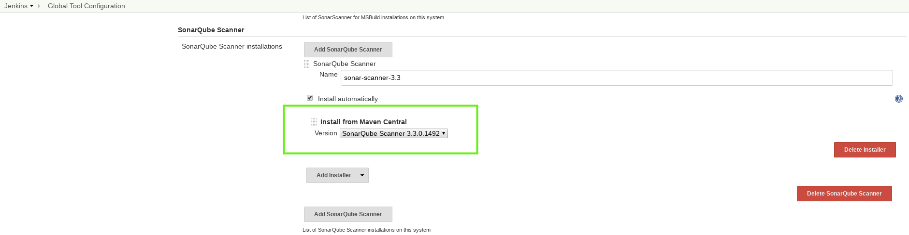
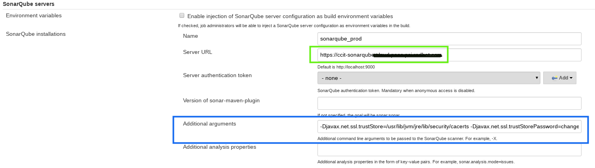

# Configure Sonar-Scanner for Https Sonar Server

Reference blogs:

[SonarQube Jenkins plugin with Https][1]

## Environment

Jenkins version 2.121.3
SonarQube 7.4+

## Issue

Sometimes the Job can fail with an SSL error that tells you "unable to find
valid certification path to requested target".

## Solution

Upgrade the sonarqube scanner Jnekins plugin from 2.8 to 2.9.

Configure Jenkins in "Global Tools Configuration" to install from maven central
the newest sonar-scanner version.


Then you need to import the SonarQube certificate into the JVM that runs the
SonarQube command.
In order to import the RH certs to the JVM you just need to follow the
instructions [here][2] in section 5.d and run the modify.sh script.

The last part of the solution will be to tell sonar-scanner where is the
correct cacerts path is:

### Configure manually

If you are running sonar-scanner in your local machine you just need to export
the following variable like that:

```bash
export SONAR_SCANNER_OPTS="-Djavax.net.ssl.trustStore=/usr/lib/jvm/jre/lib/security/cacerts"
```

sonar-scanner uses this variable to configure the Java command that runs in
the background.

### Configure Jenkins plugin

If you are running sonar-scanner using the sonar-scanner Jenkins plugin you can
add the following Java variables in the "Additional arguments" section.

```bash
-Djavax.net.ssl.trustStore=/usr/lib/jvm/jre/lib/security/cacerts -Djavax.net.ssl.trustStorePassword=changeit
```



---

[1]: https://support.cloudbees.com/hc/en-us/articles/115001445548-How-to-Configure-SonarQube-plugin-for-HTTPS-Sonar-Server-  

[2]: https://docs.engineering.redhat.com/pages/viewpage.action?pageId=63281222  
