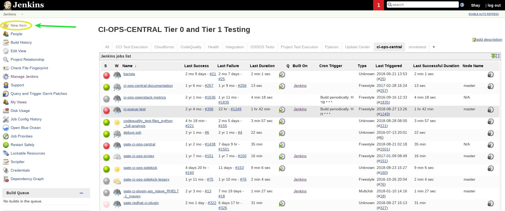
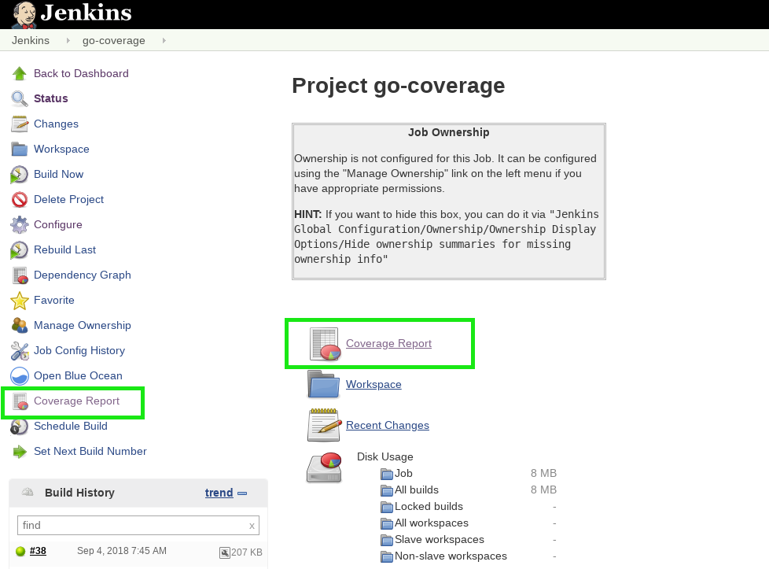

# Golang Code Coverage

The following document goes through running code coverage for Golang,
automation with Jenkins and integration with SonarQube. As you can read in
[The Go Blog][1] - The code coverage tool to be used for Golang is
a built-in tool.

This document is separated into 3 parts:

- **Manual Coverage** - will present you the supported method of
     running code coverage on Golang.
- **Jenkins Automation** - will introduce the basic steps in order to
     automate the coverage process using the web UI.
- **SonarQube Integration** - will teach you how to publish your
     results to SonarQube using the Jenkins web UI as well as manually.

 ------------------------------------------------------------------------------

## Manual Coverage

> ⚔ Note: The release of Go 1.2 introduces the new built-in tool for
test coverage. It is strongly recommended reading
[The Go Blog][1] in order to understand
how it works.

### Running code coverage manually

1. running code coverage `go test -cover`

2. You can ask "go test" to run coverage as before but also write
    a "coverage profile" for us, a file that holds the collected statistics
    so we can study them in more detail. To do that use the -coverprofile flag
    to specify a file for the output like that:
    `go test -coverprofile=cover.out`

3. To study the "cover.out" file, we can run the test coverage tool ourselves,
    without "go test" and we can brake it down by function with
    `go tool cover -func=cover.out`

4. A much more interesting way to see the data is to get an HTML presentation
    of the source code decorated with coverage information. This display is
    invoked by the -html flag: `go tool cover -html=cover.out`.
    When this command is run, a browser window pops up, showing the covered
    (green), uncovered (red), and uninstrumented (grey) source.

#### Example

The following example includes a small function and test file and a correction of
 the tests according to the results we received from coverage results. Let's
 assume you have the following 2 Golang files:

- **size.go**

```Go
package size

func Size(a int) string {
    switch {
    case a < 0:
        return "negative"
    case a == 0:
        return "zero"
    case a < 10:
        return "small"
    case a < 100:
        return "big"
    case a < 1000:
        return "huge"
    }
    return "enormous"
}
```

- **size_test.go**

```Go
package size

import "testing"

type Test struct {
    in  int
    out string
}

var tests = []Test{
    {-1, "negative"},
    {5, "small"},
}

func TestSize(t *testing.T) {
    for i, test := range tests {
        size := Size(test.in)
        if size != test.out {
            t.Errorf("#%d: Size(%d)=%s; want %s", i, test.in, size, test.out)
        }
    }
}

```

> ⚔ Note: You need to create a file whose name ends _test.go that contains the
TestSize function as described here. Put the file in the same package as
the one being tested. The file will be excluded from regular package
builds but will be included when the “go test” command is run. For more
detail about testing, you can see [here](https://golang.org/pkg/testing/)

1. run the command `go test -cover`

```Go
PASS
coverage: 42.9% of statements
ok      size    0.026s
%
```

Notice that the coverage is 42.9%, which isn't very good. Before we ask how to
 raise that number, let's see how that was computed. When test coverage is
 enabled, "go test" runs the "cover" tool, a separate program included with
 the distribution, to rewrite the source code before compilation. Here's what
 the rewritten Size function looks like.

```Go
    func Size(a int) string {
        GoCover.Count[0] = 1
        switch {
        case a < 0:
            GoCover.Count[2] = 1
            return "negative"
        case a == 0:
            GoCover.Count[3] = 1
            return "zero"
        case a < 10:
            GoCover.Count[4] = 1
            return "small"
        case a < 100:
            GoCover.Count[5] = 1
            return "big"
        case a < 1000:
            GoCover.Count[6] = 1
            return "huge"
        }
        GoCover.Count[1] = 1
        return "enormous"
    }

```

Each executable section of the program is annotated with an assignment
 statement that, when executed, records that that section ran. When the test
 run completes, the counters are collected and the percentage is computed by
 seeing how many were set.

A big advantage of this source-level approach to test coverage is that it's
 easy to instrument the code in different ways. For instance, we can ask not
 only whether a statement has been executed, but how many times.

The go test command accepts a -covermode flag to set the coverage mode to one
 of three settings:

- set: did each statement run?
- count: how many times did each statement run?
- atomic: like count, but counts precisely in parallel programs

we can simply use it by running the following command

```Go
go test -covermode=count -coverprofile=count.out

```

2. Now in order to raise the coverage number we can add some test cases
   in our var "tests" in size_test.go file like that:

```Go
var tests = []Test{
    {-1, "negative"},
    {5, "small"},
    {0, "zero"},
    {99, "big"},
    {999, "huge"},
}
```

3. Then run again "go test -cover" and the output should look like:

```Go
PASS
coverage: 85.7% of statements
ok      size    0.001s
%
```

This result shows better coverage than the previous one!

------------------------------------------------------------------------------;

## Jenkins Automation

### Prerequisites

- [Jenkins v1.653+](https://jenkins.io/)
- [Cobertura plugin
    v1.9.8+](https://wiki.jenkins-ci.org/display/JENKINS/Cobertura+Plugin)
- testing environment running:

  - fedora v28
  - Golang 1.10.3
  - git

  > ⚔ Note: you could either use a provisioning system such as [docker daemon](https://docs.docker.com/engine/reference/commandline/dockerd/),
[OpenShift](https://github.com/openshift), [OpenStack](https://github.com/openstack),
[Kubernetes](https://kubernetes.io/), etc. or use a local environment.

### Automating and Uploading coverage results to Jenkins

Continuing from the previous chapter, assuming our project files are held on
 a remote GitHub repository **[https://github.com/RedHatQE/CodeQuality.git](https://github.com/RedHatQE/CodeQuality.git)** under the folder "./examples/golang-test-repo/".

#### Manual Example

1. In the main Jenkins page, click on `New Item` button to create a new job



2. Name your job, select the `Freestyle Project` radio button and save the
    new job


3. On the newly opened screen, scroll down and create a new bash script
    build step


4. Sometimes it's useful to have your coverage results uploaded to your
    Jenkins master which could ease troubleshooting processes in case of large
    scale development efforts which might require several independent coverage
    jobs.

For that purpose, we will use the [Jenkins Cobertura plugin](https://wiki.jenkins-ci.org/display/JENKINS/Cobertura+Plugin)
 in order to preview this results in our job's web UI.

 Paste the following deployment script onto the bash text editor.

```shell
# Creating path for Go code
mkdir -p gocode/src/github.com/
cd gocode/src/github.com/

# Downloading the package and Test files
git clone https://github.com/RedHatQE/CodeQuality.git

# Download, install Golang and Define Env variables
dnf install -y golang
export PATH=/usr/local/go/bin:$PATH
export PATH=${WORKSPACE}/gocode/bin:$PATH
export GOPATH=${WORKSPACE}/gocode

# Generating Coverage report
cd CodeQuality/examples/golang-test-repo/
go test -coverprofile=cover.out

# Download tool and convert report to XML file
go get github.com/axw/gocov/gocov
go get github.com/AlekSi/gocov-xml
gocov convert cover.out | gocov-xml > coverage.xml
```


Let's have a look for a moment at our script, we can see it's divided into
 some parts:

- Installation of prerequisites
- Preparing path for the code, install Golang, and defining env variables
- Cloning the project from GitHub and running our tests with coverage to
   create a report (as seen in the previous chapter)
- Converting the coverage output file (cover.out) using
   [gocov-xml](https://github.com/AlekSi/gocov-xml) to an XML one in order
   to publish it on Jenkins using Cobertura.

> ⚔ Note: in most cases, each of these parts will be more complicated
and it's a good habit to break each part into it's own bash build
step to ease troubleshooting.

> ⚔ Note: with cover.out file we can publish the report to SonarQube
and with coverage.xml file we can publish it in Jenkins
using Cobertura.

5. In the job's configuration screen, add a "post-build action". upload the
    "coverage.xml" file which we created with gocov-xml.


6. Input a relative glob path to the generated report path and save the job
    in order to push the "coverage.xml" file which we created with gocov-xml.

```Jenkins
**/gocode/src/github.com/CodeQuality/examples/golang-test-repo/coverage.xml
```


7. Run a build of our newly created job.


8. After running our job you will be able to view the report's preview in
    your job's main screen.




**And we're done!** on the next chapter you will learn how to publish your
   generated results into SonarQube to view them.

------------------------------------------------------------------------------;

## SonarQube Integration

### Prerequisites

- [Jenkins v1.653+](https://jenkins.io/)
- [SonarQube v6.7 LTS](https://docs.sonarqube.org/display/SONAR/Setup+and+Upgrade)
- [SonarQube Runner v2.8+](https://docs.sonarqube.org/display/SCAN/Analyzing+with+SonarQube+Scanner)

> ⚔ Note: in order to deploy a SonarQube instance, you can refer to the
[Installing Sonar Server v5.6.3](https://docs.engineering.redhat.com/display/CentralCI/Installing+Sonar+Server+v5.6.3)
document or use the Central-CI instances,
see [Central CI SonarQube Instances](https://docs.engineering.redhat.com/display/CentralCI/Central+CI+SonarQube+Instances) for more information.

> ⚔ Note: for Jenkins Sonar plugin configuration see
[Analysing with SonarQube Scanner for Jenkins](https://docs.sonarqube.org/display/SCAN/Analyzing+with+SonarQube+Scanner+for+Jenkins) for details.

### Integrating SonarQube through the Jenkins web UI

As a direct continuation of the previous chapter, building on the same Jenkins
job, we'll now add the SonarQube integration.

#### Example

1. In the job configuration, choose "Add build step"
and "Execute SonarQube Scanner"


2. Paste your sonar parameters onto the text editor and SAVE the job


 Now let's have a look at these parameters:

```shell
# projectKey (string): SonarQube project identification key (unique)
sonar.projectKey=go-coverage
# projectName (string): SonarQube project name (NOT unique)
sonar.projectName=go-coverage
# projectVersion (decimal): Analyzed project version (unique)
sonar.projectVersion=1.0
# sources (string): source code home directory
sonar.sources=.
# projectBaseDir (string): project home directory (same as sources)
sonar.projectBaseDir=${WORKSPACE}/gocode/src/github.com/CodeQuality/examples/golang-test-repo/
# language (string): project language(go)
sonar.language=go
# inclusions (string): file inclusion pattern
sonar.inclusions=**/*.go
# exclusions (string): file exclusion pattern
sonar.exclusions=**/*_test.go
# coverage files
sonar.go.coverage.reportPaths=cover.out
# sonar user token
sonar.login=<your token>
```

> ⚔ Note: With cover.out file we can publish the report to SonarQube and
with coverage.xml file we can publish it in Jenkins using Cobertura.

> ⚔ Note: For generating your token see the instruction
[in SonarQube official site](https://docs.sonarqube.org/display/SONAR/User+Token)

> ⚔ Note: for further details on SonarQube analysis parameters,
see [Analysis Parameters](https://docs.sonarqube.org/display/SONAR/Analysis+Parameters).

3. Run a build again to view the reported results


You'd now be able to see a link to the results on the job's page which will
lead you to the SonarQube dashboard.

  

**And we are done!** you will now have a link to the published
   SonarQube report dashboard

  

### Publishing to SonarQube manually

Sometimes it's useful to be able to publish our coverage report to
SonarQube manually. Although it is **not a recommended** methodology,
we will elaborate upon the needed steps for those ends.

> ⚔ Note: in this section we assume you are running an up-to-date RedHat
distribution(Fedora, CentOS, RHEL)

#### Example

As a continuation of the previous examples and assuming our generated
coverage report is located in our project folder.

1. Follow the instruction of SonarQube documentation and install
[v3.2+ of SonarScanner](https://docs.sonarqube.org/display/SCAN/Analyzing+with+SonarQube+Scanner),
 which is the client agent for the SonarQube server. In addition add the
<install_directory>/bin directory to your PATH.

2. Now, in addition to our previous scanning parameters while publishing to
sonar through the Jenkins UI:

    ```shell
    # projectKey (string): SonarQube project identification key (unique)
    sonar.projectKey=go_coverage_testfiles
    # projectName (string): SonarQube project name (NOT unique)
    sonar.projectName=go_coverage_testfiles
    # projectVersion (decimal): Analyzed project version (unique)
    sonar.projectVersion=1.0
    # sources (string): source code home directory
    sonar.sources=.
    # projectBaseDir (string): project home directory (same as sources)
    sonar.projectBaseDir=<path to your project folder>
    # language (string): project language(go)
    sonar.language=go
    # inclusions (string): file inclusion pattern
    sonar.inclusions=**/*.go
    # exclusions (string): file exclusion pattern
    sonar.exclusions=**/*_test.go
    # sonar user token
    sonar.login=<your token>

    ```

    We will now also include the SonarServer URL, in this example we are
     using the CentralCI production instance:

    ```shell
    # host.url (string): the URL pointing to the SonarServer instance
    sonar.host.url=http://sonar-server.lab.eng.rdu2.redhat.com:9000
    ```

    Create a configuration file in the root directory of the project called
     "sonar-project.properties" and copy all parameters to this file.

    Run the following command from the project base directory to
     launch the analysis:

    ```shell
    sonar-scanner
    ```

3. Finally, you should be able to see a success prompt with a link to your
published coverage report dashboard such as this one:

    ```shell
    INFO: Analysis report uploaded in 522ms
    INFO: ANALYSIS SUCCESSFUL, you can browse http://sonar-server.lab.eng.rdu2.redhat.com:9000/dashboard/index/go_coverage_testfiles
    INFO: Note that you will be able to access the updated dashboard once the server has processed the submitted analysis report
    INFO: More about the report processing at http://sonar-server.lab.eng.rdu2.redhat.com:9000/api/ce/task?id=AWWp5vn7Nh3poVd2aRoR
    INFO: Task total time: 5.748 s
    INFO: ------------------------------------------------------------------------
    INFO: EXECUTION SUCCESS
    INFO: ------------------------------------------------------------------------
    INFO: Total time: 7.688s
    INFO: Final Memory: 8M/246M
    INFO: ------------------------------------------------------------------------

    ```

    **And your results have been published! (:**

------------------------------------------------------------------------------;

#### JJB Example


    - job:
        name: golang_coverage

        #######################################################
        ############## SonarQube Parameters ###################
        #######################################################

        # sonarqube project parameters, set before build
        parameters:
          - string:
              name: SONAR_KEY
              default: golang_coverage
              description: "SonarQube unique project key"
          - string:
              name: SONAR_NAME
              default: Testfiles Golang Analysis
              description: "SonarQube project name"
          - string:
              name: SONAR_PROJECT_VERSION
              default: "1.0"
              description: "SonarQube project version"

        #######################################################
        ############### Logging Aggregation ###################
        #######################################################

        # define how many days to keep build information
        properties:
          - build-discarder:
              days-to-keep: 60
              num-to-keep: 200
              artifact-days-to-keep: 60
              artifact-num-to-keep: 200

        #######################################################
        ################### Slave Image #######################
        #######################################################

        node: ssh_slave

        #######################################################
        ################ Git Trigger Config ###################
        #######################################################

        # git repo to follow, skip-tag to not require auth
        scm:
          - git:
              url: https://github.com/RedHatQe/CodeQuality.git
              basedir: ${WORKSPACE}/gocode/src/github.com/
              skip-tag: true

        #######################################################
        ################### Build Steps #######################
        #######################################################

        builders:

          # project deployment script goes here
          - shell: |
              # Creating path for Golang code
              mkdir -p gocode/src/github.com/
              cd gocode/src/github.com/

              # Download, install Go and Define Env variables
              dnf install -y golang
              export PATH=/usr/bin/go/bin:$PATH
              export PATH=${WORKSPACE}/gocode/bin:$PATH
              export GOPATH=${WORKSPACE}/gocode

              # Generating Coverage report
              cd examples/golang-test-repo/
              go test -coverprofile=cover.out

              # Download tool and convert report to XML file
              go get github.com/axw/gocov/gocov
              go get github.com/AlekSi/gocov-xml
              gocov convert cover.out | gocov-xml > coverage.xml

          # sonar runner parameters, set sources and baseDir to project home
          # projectKey (string): SonarQube project identification key (unique)
          # projectName (string): SonarQube project name (NOT unique)
          # projectVersion (string): SonarQube project version (unique)
          # sources (string): source code home directory
          # projectBaseDir (string): project home directory (same as sources)
          # language (string): project language(ruby)
          # inclusions (string): file inclusion pattern
          # exclusions (string): file exclusion pattern
          # login (string): SonarQube server user name
          # password (string): SonarQube server user password
          - sonar:
              sonar-name: sonarqube_prod
              properties: |
                sonar.projectKey=$SONAR_KEY
                sonar.projectName=$SONAR_NAME
                sonar.projectVersion=$SONAR_PROJECT_VERSION
                sonar.sources=${WORKSPACE}/gocode/src/github.com/examples/golang-test-repo/
                sonar.projectBaseDir=${WORKSPACE}/gocode/src/github.com/examples/golang-test-repo/
                sonar.go.coverage.reportPaths=cover.out
                sonar.language=go
                sonar.inclusions=**/size.go
                sonar.exclusions=**/*_test.go
                sonar.login=test
                sonar.password=test
                sonar.ws.timeout=180


          ########################################################
          ################### Report Publisher ####################
          #########################################################

          # publishes aggregated results to Jenkins
        publishers:
          - cobertura:
              report-file: "**/gocode/src/github.com/examples/golang-test-repo/coverage.xml"
              targets:
                - line:
                    healthy: 0
                    unhealthy: 0
                    failing: 0


#### Jenkinsfile Example

      pipeline {
          agent { label 'ssh_slave' }
          options {
            skipDefaultCheckout true
          }
          stages {
              stage('Deploy and Analyse') {
                  steps {
                    // clone project and install dependencies
                    // run tests with coverage and export results to xml
                    sh '''
                    mkdir -p gocode/src/github.com/
                    cd gocode/src/github.com/
                    git clone https://github.com/RedHatQE/CodeQuality.git
                    dnf install -y golang
                    export PATH=/usr/local/go/bin:$PATH
                    export PATH=${WORKSPACE}/gocode/bin:$PATH
                    export GOPATH=${WORKSPACE}/gocode
                    cd CodeQuality/examples/golang-test-repo/
                    go test -coverprofile=cover.out
                    go get github.com/axw/gocov/gocov
                    go get github.com/AlekSi/gocov-xml
                    gocov convert cover.out | gocov-xml > coverage.xml
                    '''
                  }
              }
              stage('Report') {
                  /*
                  sonar runner parameters, set sources and baseDir to project home
                  ========================

                  projectKey (string): SonarQube project identification key (unique)
                  projectName (string): SonarQube project name (NOT unique)
                  projectVersion (string): SonarQube project version (unique)
                  sources (string): source code home directory
                  projectBaseDir (string): project home directory (same as sources)
                  language (string): project language(go)
                  inclusions (string): file inclusion pattern
                  exclusions (string): file exclusion pattern
                  login (string): SonarQube server user name
                  password (string): SonarQube server user password
                   */
                  steps {
                      writeFile file: "${pwd()}/sonar-project.properties", text: """
                      sonar.projectKey=test-files_1_0_golang_coverage_analysis
                      sonar.projectName=go-coverage
                      sonar.projectVersion=1.0
                      sonar.sources=${pwd()}/gocode/src/github.com/CodeQuality/examples/golang-test-repo/
                      sonar.projectBaseDir=${pwd()}/gocode/src/github.com/CodeQuality/examples/golang-test-repo/
                      sonar.go.coverage.reportPaths=cover.out
                      sonar.language=go
                      sonar.inclusions=**/*.go
                      sonar.exclusions=**/*_test.go
                      sonar.login=test
                      sonar.password=test
                      sonar.ws.timeout=180
                      """

                    // initite pre-configured sonar scanner tool on project
                    // 'soanrqube_prod' is our cnfigured tool name, see yours
                    // in the Jenkins tool configuration
                    withSonarQubeEnv('sonarqube_prod') {
                      sh "${tool 'sonar-scanner-2.8'}/bin/sonar-scanner"
                  }
               }
            }
         }
      }


# Code Coverage with integration tests

Reference blogs:

[Getting Code Coverage from External Testing](https://husobee.github.io/golang/test/coverage/2015/11/17/external-test-coverage.html)

[Generating Coverage Profiles for Golang Integration Tests](https://www.cyphar.com/blog/post/20170412-golang-integration-coverage)

## Preparation

As a continuation of what was explained above, the general idea of executing
unit tests is that once you run "go test", all your software is recompiled,
along with the tests, and the tests in the main_test.go are executed.

For our purpose, we can create a compiled file containing the instrumentation
needed for code coverage (by passing -c -o <file> to "go test") without
actually running the main.go file, and using only that without re-compiling
the source code. It is important to note, that the only way golang allows
you to to obtain code coverage is by running "go test" rather than running
"go build", because code coverage belongs only to the "world" of tests.

To compile it with code coverage instrumentation, we'll create a test file
that does nothing other than "run main.go file". After we compile it we will
get the same older code only with the ability to use it for generating code
coverage statistics at the end of its run (see example below).

### Make an executable test file

    # The meaning of -c flag is compiling.
    # The meaning of -o flag is output file.
    # compiled_test is the executable test file
    go test -c main.go main_test.go -o compiled_test
    # Here we compile the test with the possibility of code coverage.
    go test -coverprofile=main_cover.out -c main.go main_test.go -o compiled_test

## Integration test example

Now lets make a running http server to illustrate this. The server we create
will respond to GET requests and Will allow POST requests. In the end we can
run the server as a regular code and the service will work as usual and in
addition we can run the same code in a test mode in order to get the code
coverage statistics that we wanted.

The most important part is how the main.go "knows" when it runs normally and
when it runs through the tests. For this purpose we will create a function
inside main.go that will run only when we run the test file and that function
will run the main.

### Install dependencies
 

    go get github.com/codegangsta/negroni
    go get github.com/husobee/vestigo
    go get github.com/tylerb/graceful

[negroni](https://github.com/urfave/negroni) - Negroni is an idiomatic approach to web middleware in Go.
It is tiny, non-intrusive, and encourages use of net/http Handlers.

[vestigo](https://github.com/husobee/vestigo) - Vestigo is a stand alone url router which has respectable
performance that passes URL parameters to handlers by embedding them into
the request's Form.

[graceful](https://github.com/tylerb/graceful) - Graceful is a Go package enabling us to turn the http.Handler server
off at will within the code. This is super handy for us because we want to be
able to end our test, in order for go's testing framework to report the
coverage (no good if the service is interrupted or canceled or terms).

Create a main.go file like this:

    package main

    import (
            "fmt"
            "net/http"
            "time"

            "github.com/codegangsta/negroni"
            "github.com/husobee/vestigo"
            "github.com/tylerb/graceful"
    )

    var ( 
            // "grcfSrv" is the graceful server
            grcfSrv = &graceful.Server{
                    Timeout: 5 * time.Second,
            } 
            // "stopGrcf" is the boolean channel that decides when to stop the server.
            // We will use it as soon as we are in test mode, and so we can stop
            // the server in an orderly way and get the code coverage at the end.
            stopGrcf     chan bool
            // "isTestsRuns" is a bool which checks whether we are running in test mode
            // or that it is a normal run of the main. 
            isTestsRuns bool = false
    )

    // mainFromTest - "go test" will enter main from this function. we will setup isTestsRuns
    // here, as well as the stopGrcf boolean in order to stop the service.
    func mainFromTest() {
            // start the boolean channel
            stopGrcf = make(chan bool)
            // define test mode
            isTestsRuns = true
            // run the main function
            go main()
            // Start tracking the channel
            <-stopGrcf
            // stop the graceful server
            grcfSrv.Stop(5 * time.Second)
    }
    
    // our main function that create the http server
    func main() {
            // define default middleware
            negClass := negroni.Classic()

            // define vestigo router
            vestRoute := vestigo.NewRouter()

            // Set a POST request that is triggered using /cover
            vestRoute.Post("/cover", func(w http.ResponseWriter, r *http.Request) {
                    if false {
                            fmt.Println("This line will never be covered")
                    }
                    w.WriteHeader(200)
                    w.Write([]byte("done"))
            })

            // Set a GET request that is triggered using /hello
            vestRoute.Get("/hello", func(w http.ResponseWriter, r *http.Request) {
                fmt.Fprintf(w, "Hey, This line will be covered")
            })

            // Only if we are in test mode will we allow an orderly halt
            // of the software from outside.
            if isTestsRuns {
                    // endpoint that will stop the service if stopGrcf is
                    // a live channel (only if mainFromTest function runs).
                    vestRoute.Post("/stopservice", func(w http.ResponseWriter, r *http.Request) {
                            stopGrcf <- true
                    })
            }

            // add vestRoute to negroni
            negClass.UseHandler(vestRoute)

            // define graceful port and handler
            grcfSrv.Server = &http.Server{Addr: ":3456", Handler: negClass}
            grcfSrv.ListenAndServe()
    }


## The main_test.go file!

Now we will create a simple test file that run the main function. As explained
above, if we run the main.go using "go build" then mainFromTest function will
never run.

Create a main_test.go file like this:

    package main

    import (
            "testing"
    )

    // TestMain - Test function that runs the main
    func TestMain(t *testing.T) {
            mainFromTest()
    }

We're almost done! Now we have to run main() along with the option to cover the
code. We have 2 options to do this:

Option 1:

    # Create a test binary with coverage flag instead of the original main file.
    go test -coverprofile=main_cover.out -c main.go main_test.go -o compiled_test
    # Run the test and specify the coverage output file
    ./compiled_test -test.coverprofile=main_cover.out -test.v -test.run=TestMain

Option 2:

    # You can run in one command by explicitly calling TestMain:
    go test -coverprofile=main_cover.out -run=TestMain

Run the tests and stop the http server:

    # In a new terminal run these curl commands:
    curl -XPOST http://127.0.0.1:3456/cover
    curl http://127.0.0.1:3456/hello
    curl -XPOST http://127.0.0.1:3456/stopservice
    
 More detailed report:   
    
    # A wider view of what runs fully and what runs only partially.
    go tool cover -func=main_cover.out
    _/home/user/go_coverage/main/main.go:29:       mainFromTest         100.0%
    _/home/user/go_coverage/main/main.go:43:       main            93.3%
    total:                          (statements)    95.0%

The advantage for "Option 1" is that we do not have to recompile the whole
code each time whenever we want to run tests, but the advantage for
"Option 2" is when we want to Merge all the reports (in case it is one report
from a large project), it is much more convenient because the path in the
report file refers to the entire project, not just to the binary file (Of
course you can edit the reporting file in the first option so that it will
relate the whole project as we want).

main_cover.out file with "Option 1":

    mode: set
    command-line-arguments/main.go:34.16,45.2 5 1
    command-line-arguments/main.go:48.13,56.75 3 1
    command-line-arguments/main.go:68.9,68.21 1 1
    command-line-arguments/main.go:78.9,83.29 3 1
    command-line-arguments/main.go:56.75,57.26 1 1
    command-line-arguments/main.go:62.17,63.40 2 1
    command-line-arguments/main.go:57.26,61.18 1 0
    command-line-arguments/main.go:68.21,71.88 1 1
    command-line-arguments/main.go:71.88,74.18 1 1

main_cover.out file with "Option 2":

    mode: set
    _/home/user/go_coverage/main/main.go:34.16,45.2 5 1
    _/home/user/go_coverage/main/main.go:48.13,56.75 3 1
    _/home/user/go_coverage/main/main.go:68.9,68.21 1 1
    _/home/user/go_coverage/main/main.go:78.9,83.29 3 1
    _/home/user/go_coverage/main/main.go:56.75,57.26 1 0
    _/home/user/go_coverage/main/main.go:62.17,63.40 2 0
    _/home/user/go_coverage/main/main.go:57.26,61.18 1 0
    _/home/user/go_coverage/main/main.go:68.21,71.88 1 1
    _/home/user/go_coverage/main/main.go:71.88,74.18 1 1

## Merge Coverage Profiles

Suppose all the examples on this page are part of an "go_coverage" entire
project whose folder tree looks something like this:

    .
    ├── main
    │   ├── main_cover.out
    │   ├── main.go
    │   ├── main_test.go
    │   └── compiled_test
    └── size
        ├── size_cover.out
        ├── size.go
        └── size_test.go


Since you probably also run unit tests (size_test.go), you might want
to merge the coverage profiles with [gocovmerge](https://github.com/wadey/gocovmerge)

[gocovmerge](https://github.com/wadey/gocovmerge) - gocovmerge takes the results from multiple
"go test -coverprofile" runs and merges them into one profile.


    # Install gocovmerge
    $ go get github.com/wadey/gocovmerge
    # Gather all coverage profiles. Run this under root project folder
    $ gocovmerge main/main_cover.out size/size_cover.out > all_cover.out
    # View the final profile on browser
    $ go tool cover -html all_cover.out

Or you can push all_cover.out file to the SonarQube server using a similar file
in your project root folder:

    sonar.projectKey=go_integration_tests
    sonar.projectName=go-integ-tests
    sonar.projectVersion=1.0
    sonar.sources=.
    sonar.projectBaseDir=.
    sonar.go.coverage.reportPaths=all_cover.out
    sonar.language=go
    sonar.inclusions=**/*.go
    sonar.exclusions=**/*_test.go
    sonar.login=<user>
    sonar.password=<password>
    sonar.ws.timeout=180
    sonar.host.url=<sonar_url>


Have fun!!

------------------------------------------------------------------------------

[1]: https://blog.golang.org/cover
