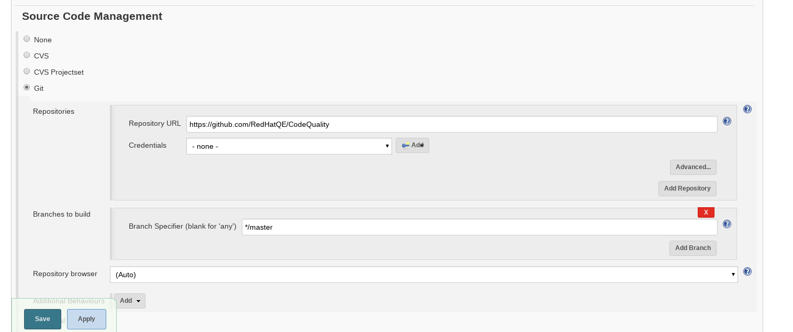
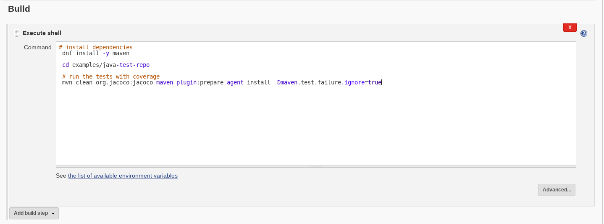

# Java Code Coverage

The following document goes through running code coverage for Java, automation with Jenkins and integration with SonarQube. The code coverage tool to be used for Java is [JaCoCo](http://www.eclemma.org/jacoco/trunk/index.html).

> ⚔ Note: This document currently covers coverage reporting for Maven based projects, for a wider Project Management support please contact us.

This document is separated into 3 parts:

- **Manual Coverage** - section will present you the supported method of running code coverage on Java.
- **Jenkins Automation** - section will introduce the basic steps in order to automate the coverage process using the web UI.
- **SonarQube Integration** - section will teach you how to publish your results to SonarQube using the Jenkins web UI as well as manually.

> ⚔ Note: Additional advanced topics such as JJB configuration are covered at the bottom of the document under the **Advanced Topics** section.

## Table of Contents

<!-- TOC depthFrom:1 depthTo:4 withLinks:1 updateOnSave:1 orderedList:0 -->

 - [Java Code Coverage](#java-code-coverage)
  - [Table of Contents](#table-of-contents)
  - [Manual Coverage](#manual-coverage)
    - [Prerequisites](#prerequisites)
    - [Running code coverage manually](#running-code-coverage-manually)
      - [Example](#example)
  - [Jenkins Automation](#jenkins-automation)
    - [Prerequisites](#prerequisites)
    - [Automating using the web UI](#automating-using-the-web-ui)
      - [Example](#example)
    - [Uploading coverage results to Jenkins](#uploading-coverage-results-to-jenkins)
      - [Example](#example)
  - [SonarQube Integration](#sonarqube-integration)
    - [Prerequisites](#prerequisites)
    - [Integrating SonarQube through the Jenkins web UI](#integrating-sonarqube-through-the-jenkins-web-ui)
      - [Example](#example)
    - [Publishing to SonarQube manually](#publishing-to-sonarqube-manually)
      - [Example](#example)

<!-- /TOC -->

 --------------------------------------------------------------------------------

## Manual Coverage

### Prerequisites

- [Java JDK v1.7+](http://www.oracle.com/technetwork/java/javase/overview/index.html)
- [Maven v3.1+](https://maven.apache.org)

> ⚔ Note: notice there are several methods and tools to run code coverage such as [JCov](https://wiki.openjdk.java.net/display/CodeTools/jcov), [Clover](https://www.atlassian.com/software/clover), [Cobertura](http://cobertura.github.io/cobertura/) and [EMMA](http://emma.sourceforge.net/), we will only introduce one way of going about it which we have concluded to be the most suitable and straightforward for this process.

### Running code coverage manually

1. in order to run coverage on your maven project's tests, simple run

    ```shell
    mvn clean org.jacoco:jacoco-maven-plugin:prepare-agent install -Dmaven.test.failure.ignore=true
    ```

    > ⚔ Note: The parameters above requires the JaCoCo plugin to install it's run-time agent for your tests and continue testing if either of your tests fail.

    > ⚔ Note: For advanced configuration options, see [Maven Plug-in](http://www.eclemma.org/jacoco/trunk/doc/maven.html) but note that the default configuration is being propagated automatically based on your POM.

2. coverage reports can be found at `target/jacoco.exec` in your project's root directory

#### Example

The following example includes encountering a failure and a successful run.

> ⚔ Note: This example uses the standardized [JUnit](http://junit.org/junit4/) testing framework.

Let's assume you have the following 2 Java files and an additional POM file:

- **pom.xml**

  ```xml
  <project xmlns="http://maven.apache.org/POM/4.0.0" xmlns:xsi="http://www.w3.org/2001/XMLSchema-instance"
    xsi:schemaLocation="http://maven.apache.org/POM/4.0.0 http://maven.apache.org/maven-v4_0_0.xsd">
    <modelVersion>4.0.0</modelVersion>
    <groupId>com.testingjava.app</groupId>
    <artifactId>maven-test-project</artifactId>
    <packaging>jar</packaging>
    <version>1.0</version>
    <name>Maven Test Project</name>
    <url>http://maven.apache.org</url>
    <dependencies>
      <dependency>
        <groupId>junit</groupId>
        <artifactId>junit</artifactId>
        <version>3.8.1</version>
        <scope>test</scope>
      </dependency>
    </dependencies>
  </project>
  ```

- **src/main/.../App.java**

  ```java
  package com.testingjava.app;

  /**
   * our simple app class
   */
  public class App
  {
      public static String printIt(String name)
      {
        return "Hello " + name;
      }
  }
  ```

- **src/test/.../AppTest.java**

  ```java
  package com.testingjava.app;

  import junit.framework.TestCase;

  /**
   * Unit test for our simple App.
   */
  public class AppTest
      extends TestCase
  {
      /**
       * Create the test case
       *
       * @param testName name of the test case
       */
      public AppTest( String testName )
      {
          super( testName );
      }

      /**
       * Making a simple test
       */
      public void testApp()
      {
          assertEquals(App.printIt("Bob"), "Welcome Bob");
      }
  }
  ```

> ⚔ Note: The following files were generated using a [basic maven project archetype](https://mvnrepository.com/artifact/org.apache.maven.archetypes/maven-archetype-quickstart).

1. we attempt to run coverage for our test using

    ```shell
    mvn clean org.jacoco:jacoco-maven-plugin:prepare-agent install -Dmaven.test.failure.ignore=true
    ```

    but apparently we hit an error

    ```java
    -------------------------------------------------------
     T E S T S
    -------------------------------------------------------
    Running com.testingjava.app.AppTest
    Tests run: 1, Failures: 1, Errors: 0, Skipped: 0, Time elapsed: 0.033 sec <<< FAILURE!
    testApp(com.testingjava.app.AppTest)  Time elapsed: 0.017 sec  <<< FAILURE!
    junit.framework.ComparisonFailure: expected:<Welcome...> but was:<Hello...>
        at junit.framework.Assert.assertEquals(Assert.java:81)
        at junit.framework.Assert.assertEquals(Assert.java:87)
        at com.testingjava.app.AppTest.testApp(AppTest.java:26)
    Results :
    Failed tests:   testApp(com.testingjava.app.AppTest): expected:<Welcome...> but was:<Hello...>
    Tests run: 1, Failures: 1, Errors: 0, Skipped: 0
    [ERROR] There are test failures.
    Please refer to ./javaTest/target/surefire-reports for the individual test results.
    ```

    as you can see, we've encountered an error due to an issue in our tests!
    **Now that we've fixed the problem, you can see our tests running successfully!**

    ```java
    ----------------------------------------
     T E S T S
    ----------------------------------------
    Running com.testingjava.app.AppTest
    Tests run: 1, Failures: 0, Errors: 0, Skipped: 0, Time elapsed: 0.02 sec

    Results :

    Tests run: 1, Failures: 0, Errors: 0, Skipped: 0

    [INFO]
    [INFO] --- maven-jar-plugin:2.4:jar (default-jar) @ maven-test-project ---
    [INFO] Building jar: javaTest/target/maven-test-project-1.0.jar
    [INFO]
    [INFO] --- maven-install-plugin:2.4:install (default-install) @ maven-test-project ---
    [INFO] Installing javaTest/target/maven-test-project-1.0.jar to .m2/repository/com/testingjava/app/maven-test-project/1.0/maven-test-project-1.0.jar
    [INFO] Installing javaTest/pom.xml to .m2/repository/com/testingjava/app/maven-test-project/1.0/maven-test-project-1.0.pom
    [INFO] -------------------------------------------
    [INFO] BUILD SUCCESS
    [INFO] -------------------------------------------
    [INFO] Total time: 2.645 s
    [INFO] Finished at: 2017-04-13T15:08:27+03:00
    [INFO] Final Memory: 17M/185M
    [INFO] -------------------------------------------
      ```

2. you can now see the generated report file `jacoco.exec` in the `target` directory in the project's root directory **and we are done! (:**

> ⚔ Note: The `jacoco.exec` file is a binary file and can only be viewed by either the Jenkins plugin or SonarQube, further details on publishing these results appear in the following chapters.
--------------------------------------------------------------------------------

## Jenkins Automation

### Prerequisites

- [Jenkins v1.653+](https://jenkins.io/)
- [Jenkins JaCoCo plugin v2.2.0+](https://wiki.jenkins-ci.org/display/JENKINS/JaCoCo+Plugin)
- testing environment running:

  - fedora v23
  - Java v8+
  - git

  > ⚔ Note: you could either use a provisioning system such as [docker daemon](https://docs.docker.com/engine/reference/commandline/dockerd/), [OpenShift](https://github.com/openshift), [OpenStack](https://github.com/openstack), [Kubernetes](https://kubernetes.io/), etc. or use a local environment.

> ⚔ Note: notice there are several methods and tools to manage CI and automation such as [Gump](https://gump.apache.org/), [Hudson](http://hudson-ci.org/), [Bamboo](https://www.atlassian.com/software/bamboo), [Travis](https://travis-ci.org/) and more. We will only introduce and support Jenkins for this end as it is the standardized CI tool in RedHat.

### Automating using the web UI

Continuing from the previous chapter, assuming our project files are held on a remote github repository **<https://github.com/RedHatQE/CodeQuality/tree/master/examples/java-test-repo>**.

#### Example

1. in the main Jenkins page, click to `New Item` button to create a new job

    

2. name your job, select the `Freestyle Project` radio button and save the new job

    

3. on the newly opened screen, set the `Source Code Management` to git and fill in our repository

    

4. scroll down, click `Add build step` and select `Execute shell` to create a new bash script build step

    

5. paste the following deployment script onto the bash text editor

    ```shell
    # install dependencies
    dnf install -y maven

    cd examples/java-test-repo

    # run the tests with coverage
    mvn clean org.jacoco:jacoco-maven-plugin:prepare-agent install -Dmaven.test.failure.ignore=true
    ```

    > ⚔ Note: we are using Fedora v23+, if you are using a older version or a different redhat distribution, you might want to try 'yum' instead of 'dnf'

    > ⚔ Note: the **-y** parameter in the dnf command approves installation prompts which is mandatory for automation purposes.

    

    let's have a look for a moment at our script, we can see it's divided into 2 main parts:

    - installation of prerequisites
    - running our tests with coverage to create a report (as seen on the previous chapter)

      > ⚔ Note: in most cases, each of these parts will be more complicated and it's a good habit to break each part into it's own bash build step to ease troubleshooting

6. run a build of our newly created job

    

    **And we're done!** on the next chapter you will learn how to publish your generated results into SonarQube to view them.

### Uploading coverage results to Jenkins

Sometimes it's useful to have your coverage results uploaded to your Jenkins job which could ease troubleshooting procceses in case of large scale development efforts which might require several independant coverage jobs.

For that purpose, we will use the [Jenkins JaCoCo plugin](https://wiki.jenkins-ci.org/display/JENKINS/JaCoCo+Plugin) in order to preview this results in our job's web UI.

#### Example

Continuing from the previous section, assuming our newly created job has generated a coverage report into `${WORKSPACE}/target`.

1. in the job's configuration screen, add a post-build action to record the JaCoCo coverage report

    

2. input the following relative paths in the actions configuration fields save the job

    - **Path to exec files:** \*\*/target/\*\*.exec
    - **Path to class directories:** \*\*/target/classes
    - **Path to source directories:** \*\*/src/main/java<br>

    

3. after rerunning our job you will be able to view the report's preview in your specific build's page

    

--------------------------------------------------------------------------------

## SonarQube Integration

### Prerequisites

- [Jenkins v1.653+](https://jenkins.io/)
- [SonarQube v5.6.3 LTS](https://docs.sonarqube.org/display/SONAR/Setup+and+Upgrade)

### Integrating SonarQube through the Jenkins web UI

As a direct continuation of the previous chapter, building on the same Jenkins job, we'll now add the SonarQube integration.

#### Example

1. add the sonar configuration options to your `pom.xml` file

    ```xml
    <properties>
    <project.build.sourceEncoding>UTF-8</project.build.sourceEncoding>

    <!-- language (string): project language(java) -->
    <sonar.language>java</sonar.language>

    <!-- host.url (string): SonarQube server URL(test server URL) -->
    <sonar.host.url>sonar_server_address</sonar.host.url>

    <!-- projectKey (string): SonarQube project identification key (unique) -->
    <sonar.projectKey>maven-test-project_full-analysis</sonar.projectKey>

        <!-- inclusions (string): file inclusion pattern, used to exclude non-java files -->
      <sonar.inclusions>**/*.java</sonar.inclusions>

    <!-- ws.timeout (int): optional connection timeout parameter -->
      <sonar.ws.timeout>180</sonar.ws.timeout>
    </properties>
    ```

    > ⚔ Note: for further details on SonarQube analysis parameters, see [Analysis Parameters](https://docs.sonarqube.org/display/SONAR/Analysis+Parameters).

2. in the job configuration, add another execute shell build step for our Maven sonar report

    

3. paste in the sonar target command

    ```shell
    # publish results to sonar
    mvn sonar:sonar
    ```

    

4. run a build again to view the reported results

    

    you'd now be able to locate your project's dashboard on the SonarQube server.

    

    **And we are done!** In your project's dashboard you'll be able to view your coverage results.

    

### Publishing to SonarQube manually

Sometimes it's useful to be able to publish our coverage report to SonarQube manually. Although it is **not a recommended** methodology, we will allaborate upon the needed steps for those ends.

> ⚔ Note: in this section we assume you are running an up-to-date RedHat distribution(Fedora, CentOS, RHEL)

#### Example

1. add the sonar configuration options to your `pom.xml` file

    ```xml
    <properties>
    <project.build.sourceEncoding>UTF-8</project.build.sourceEncoding>

    <!-- language (string): project language(java) -->
    <sonar.language>java</sonar.language>

    <!-- host.url (string): SonarQube server URL(test server URL) -->
    <sonar.host.url>sonar_server_address</sonar.host.url>

    <!-- projectKey (string): SonarQube project identification key (unique) -->
    <sonar.projectKey>maven-test-project_full-analysis</sonar.projectKey>

        <!-- inclusions (string): file inclusion pattern, used to exclude non-java files -->
      <sonar.inclusions>**/*.java</sonar.inclusions>

    <!-- ws.timeout (int): optional connection timeout parameter -->
      <sonar.ws.timeout>180</sonar.ws.timeout>
    </properties>
    ```

    > ⚔ Note: for further details on SonarQube analysis parameters, see [Analysis Parameters](https://docs.sonarqube.org/display/SONAR/Analysis+Parameters).

2. run your sonar maven target

    ```shell
    mvn sonar:sonar
    ```

3. finally, you should be able to see a success prompt with a link to your published coverage report dashboard such as this one:

    ```shell
    DEBUG: Upload report
    DEBUG: POST 200 http://sonar_server_address/api/ce/submit?projectKey=some-project&projectName=Some%20Project | time=43ms
    INFO: Analysis report uploaded in 52ms
    INFO: ANALYSIS SUCCESSFUL, you can browse http://sonar_server_address/dashboard/index/some-project
    INFO: Note that you will be able to access the updated dashboard once the server has processed the submitted analysis report
    INFO: More about the report processing at http://sonar_server_address/api/ce/task?id=AVrR-YHSEXNZ6r-PQPEx
    DEBUG: Report metadata written to /root/ruby_coverage_testfiles/.sonar/report-task.txt
    DEBUG: Post-jobs :
    INFO: ---------------------------------------------
    INFO: EXECUTION SUCCESS
    INFO: ---------------------------------------------
    INFO: Total time: 13.570s
    INFO: Final Memory: 53M/215M
    INFO: ---------------------------------------------
    ```

  **and your results have been published! (:**


--------------------------------------------------------------------------------

## Advanced Topics

### Covering Sevices

In order to run coverage over a service or a process not launched manually from it's entry-point, i.e multi-service products,
API integration tests, multi-host integration tests, etc, we are proposing the following solution, which inserts a pipeline hook
to each Java process..

#### Prerequisites

- [JRE v1.5+](http://www.oracle.com/technetwork/java/javase/overview/index.html)
- [Jacoco Runtime Jar v0.8](http://repo1.maven.org/maven2/org/jacoco/org.jacoco.agent/0.8.0/org.jacoco.agent-0.8.0-runtime.jar)

#### Implementation Steps

1. Download the jacocoagent-runtime.jar using the following command:
  ```bash
  wget http://repo1.maven.org/maven2/org/jacoco/org.jacoco.agent/0.8.0/org.jacoco.agent-0.8.0-runtime.jar
  ```
  This will download the jar to your current directory, which we will call **<path to agent>**.

2. Set the **JAVA_TOOL_OPTIONS** environment variable with the correct java agent configuration for jacoco.
  ```bash
  export JAVA_TOOL_OPTIONSS="-javaagent:<path to agent>/jacocoagent-runtime.jar= \
      # A colon separated list of compiled class files, e.g. Foo.class:Bar.class:Bazz.class
      includes=<LIST OF CLASSES>, \
      # The id that the coverage run will be identified by in the coverage report.
      sessionid=<SESSION ID>, \
      # The target directory you wish the coverage report to be written to.
      destfile=<TARGET DIRECTORY>/jacoco.exec"
  ```

  > ⚔ Note: The **sessionid** parameter is optional, and jacoco will generate a random identification string if it is not set. However, it is recommended that the **SESSION ID** be set to the same string across all services being tested at the same time. For example if the test is run by Jenkins use the job name and number.

  > ⚔ Note: The **includes** parameter is optional, if it is left out the coverage report will be generated for all files including dependencies.


3. Start the service. This will start the JVM with the java agent enabled.

4. Run the tests.

5. Stop the service, this will cause the jacoco agent to dump the coverage results to the **jacoco.exec** file in your target directory.

#### Example

This example runs against the java_coverage_testfiles example project from above. For the purposes of this example **org.jacoco.agent-0.8.0-runtime.jar** has been downloaded into the root of the project.

1. Clone the example project.
  ```bash
  git clone https://github.com/RedHatQE/CodeQuality
  ```

2. Change into the cloned project.
  ```bash
  cd ~/CodeQuality/examples/java-test-repo
  ```

3. Get a copy of the org.jacoco.agent-0.8.0-runtime.jar.
  ```bash
  wget http://repo1.maven.org/maven2/org/jacoco/org.jacoco.agent/0.8.0/org.jacoco.agent-0.8.0-runtime.jar
  ```

4. Set the **JAVA_TOOL_OPTIONS** environment variable.
  ```bash
  export JAVA_TOOL_OPTIONS="-javaagent:$(pwd)/org.jacoco.agent-0.8.0-runtime.jar=includes=com.testingjava.app.AppTest,sessionid=TestSession,destfile=$(pwd)/target/jacoco.exec"
  ```

5. Run the tests.
  ```bash
  mvn test
  ```

After the tests are complete there will be a **jacoco.exec** file in the target directory.

> ⚔ Note: The **jacoco.exec** file is a binary file and can only be viewed by either the Jenkins plugin
or SonarQube.


### Jenkinsfile

Starting with Jenkins 2, automation configuration can mainitained using a Jenkinsfile
which levrages the power of Grooveyscript to describe a jenkins job.

#### Prerequisites

- [Jenkins v2.6+](https://jenkins.io/)
- [Jenkins Pipeline Plugin v2.5+](https://wiki.jenkins.io/display/JENKINS/Pipeline+Plugin)

> ⚔ Note: For more details on the Jenkinsfile format, see [Using a Jenkinsfile](https://jenkins.io/doc/book/pipeline/jenkinsfile/)

#### Example

The following file illustrates a possible Jenkinsfile configuration

```groovey
pipeline {
    agent { node { label 'ssh_slave' } }
    options {
      skipDefaultCheckout true
    }
    triggers {
      cron('0 8 * * *')
    }
    stages {
        stage('Deploy') {
            steps {
                // clone project and install dependencies
                git url: 'https://github.com/RedHatQE/CodeQuality.git'
                sh 'dnf install -y maven java-1.8.0-openjdk-devel.x86_64'
            }
        }
        stage('Analyse') {
            steps {
                // coverage tests initialization script
                sh '''mvn clean org.jacoco:jacoco-maven-plugin:prepare-agent \
                  install -Dmaven.test.failure.ignore=true || true'''
            }
        }
        stage('Report') {
            /*
            sonar runner parameters, set sources and baseDir to project home
            ========================

            projectKey (string): SonarQube project identification key (unique)
            projectName (string): SonarQube project name (NOT unique)
            projectVersion (string): SonarQube project version (unique)
            sources (string): source code home directory
            projectBaseDir (string): project home directory (same as sources)
            language (string): project language(java)
            inclusions (string): file inclusion pattern
            exclusions (string): file exclusion pattern
            login (string): SonarQube server user name
            password (string): SonarQube server user password
             */
            steps {
              writeFile file: "${pwd()}/sonar-project.properties", text: """
              sonar.projectKey=test-files_1_0_java_full-analysis
              sonar.projectName=Java Testfiles
              sonar.projectVersion=1.0
              sonar.sources=${pwd()}
              sonar.projectBaseDir=${pwd()}
              sonar.language=java
              sonar.inclusions=**/*.java
              sonar.exclusions=src/test/**/*.java
              sonar.login=test
              sonar.password=test
              sonar.ws.timeout=180
              """

              // initite pre-configured sonar scanner tool on project
              // 'sonarqube_prod' is our configured tool name, see yours
              // in the Jenkins tool configuration
              // NOTE: pay attention we are using maven under sonar env
              withSonarQubeEnv('sonarqube_prod') {
                sh 'mvn org.sonarsource.scanner.maven:sonar-maven-plugin:3.2:sonar'

              }
            }
        }
    }
}
```

### Jenkins Job Builder

Jenkins automation configuration can also be done by using the Jenkins Job builder (JJB)
which takes simple descriptions of Jenkins jobs in YAML or JSON format and uses them to configure Jenkins.

#### Prerequisites

- [Jenkins v1.653+](https://jenkins.io/)
- [Jenkins Job Builder v2.0+](https://docs.openstack.org/infra/jenkins-job-builder/)

> ⚔ Note: For more details on installing and configuring JJB, see the [Quick Start Guide](https://docs.openstack.org/infra/jenkins-job-builder/)

#### Example

The following file illustrates a possible JJB configuration

```yaml
- job:
    name: sonarqube_ruby-plugin_java_full_analysis

    #######################################################
    ############## SonarQube Parameters ###################
    #######################################################

    # sonarqube project parameters, set before build
    parameters:
      - string:
          name: SONAR_KEY
          default: sonarqube_ruby-plugin_java_full_analysis
          description: "SonarQube unique project key"
      - string:
          name: SONAR_NAME
          default: Ruby-Plugin Java Analysis
          description: "SonarQube project name"
      - string:
          name: SONAR_PROJECT_VERSION
          default: "1.0"
          description: "SonarQube project version"

    #######################################################
    ############### Logging Aggregation ###################
    #######################################################

    # define how many days to kee build information
    properties:
      - build-discarder:
          days-to-keep: 60
          num-to-keep: 200
          artifact-days-to-keep: 60
          artifact-num-to-keep: 200

    #######################################################
    ################### Slave Image #######################
    #######################################################

    node: ssh_slave

    #######################################################
    ################ Git Trigger Config ###################
    #######################################################

    # git repo to follow, skip-tag to not require auth
    scm:
      - git:
          url: https://github.com/RedHatQE/CodeQuality.git
          skip-tag: true

    # git polling trigger set to once an hour
    triggers:
      - pollscm:
          cron: "0 0 * * 0"
          ignore-post-commit-hooks: True

    #######################################################
    ################### Build Steps #######################
    #######################################################

    builders:

      # project deployment script goes here
      - shell: |
          dnf install -y maven java-1.8.0-openjdk-devel.x86_64

      # coverage tests initialization script
      - shell: |
          cd examples/java-test-repo
          mvn clean org.jacoco:jacoco-maven-plugin:prepare-agent \
            install -Dmaven.test.failure.ignore=true || true

      # sonar runner parameters, set sources and baseDir to project home
      # projectKey (string): SonarQube project identification key (unique)
      # projectName (string): SonarQube project name (NOT unique)
      # projectVersion (string): SonarQube project version (unique)
      # sources (string): source code home directory
      # projectBaseDir (string): project home directory (same as sources)
      # language (string): project language(ruby)
      # inclusions (string): file inclusion pattern
      # exclusions (string): file exclusion pattern
      # login (string): SonarQube server user name
      # password (string): SonarQube server user password
      - sonar:
          sonar-name: sonarqube_prod
          properties: |
            sonar.projectKey=$SONAR_KEY
            sonar.projectName=$SONAR_NAME
            sonar.projectVersion=$SONAR_PROJECT_VERSION
            sonar.sources=${WORKSPACE}/examples/java-test-repo
            sonar.projectBaseDir=${WORKSPACE}/examples/java-test-repo
            sonar.language=java
            sonar.inclusions=**/*.java
            sonar.exclusions=src/test/**/*.java
            sonar.login=test
            sonar.password=test
            sonar.ws.timeout=180
```
