Code Quality Management
=======================

The following document illustrates the project management procedures and data aggregation standards to be taken in creating a publishing system with [SonarQube](https://www.sonarqube.org/). It assumes knowledge of Sonarqube or prior use of Sonarqube reporting.

This document explores the following subjects:

-   **Project Structure** - section defines the resolution and structure that your coverage results should take within the Sonar system.
-   **Quality Profiles and Gates** - section will introduce to you the concepts of quality profiles, how to set and configure them.
-   **Visualization** - section will teach you how to visualize your data and display best practices for exploring your information.
-   **Aggregation** - section will explain the usage of Portfolios for aggregation purposes in large projects and filters in smaller cases.
-   **Security** - section will teach you how to expand your peoject's security configuration.

Table of Contents
-----------------


<!-- TOC depthFrom:1 depthTo:4 withLinks:1 updateOnSave:1 orderedList:0 -->
<!-- code_chunk_output -->

* [Project Unique Key](#project-unique-key)
* [Project Tagging](#project-tagging)
* [Quality Profile](#quality-profile)
	* [Setting and Extending a Quality Profile](#setting-and-extending-a-quality-profile)
* [Quality Gate](#quality-gate)
	* [Setting the Quality Gate](#setting-the-quality-gate)
* [Treemap](#treemap)
* [Activity](#activity)
* [Portfolios](#portfolios)
	* [Adding Projects](#adding-projects)
	* [Creating Sub-Portfolios](#creating-sub-portfolios)
* [Filters](#filters)

<!-- /TOC -->


------------------------------------------------------------------------

Project Structure
-----------------

To base our goal, let's assume we have the following project structure:
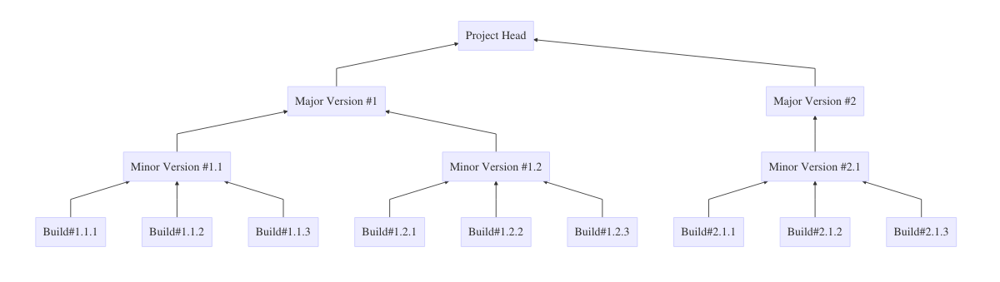
as we can see, we have a single project holding two **major versions**, each with multiple **minor versions**, comprised of several **builds**.
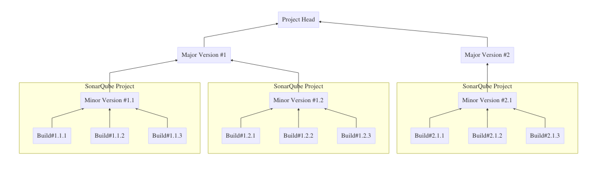
Because SonarQube enables version trending within it's Project items, we recommend creating a Project item for each minor version, thus each Project item will aggregate changing builds.

### Project Unique Key

SonarQube projects are being generated by running SonarScanner against your code base and assigning the analysis a unique key. **Key's are required to follow the form:**

``` shell
<project-identifier>_<major_version>_<minor_version>_<language>_<coverage|static|full-analysis>
```

for example:

``` shell
satellite_6_2_foreman_ruby_coverage
```

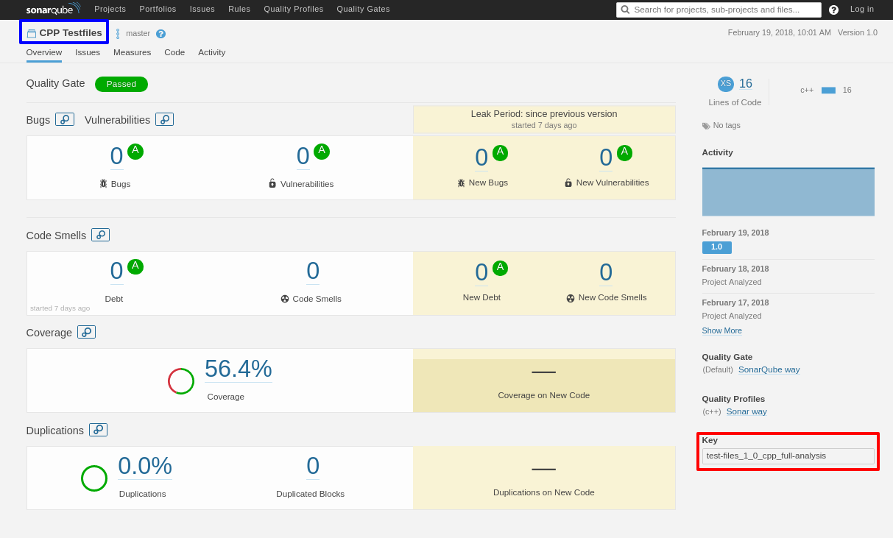

> ⚔ Note: In the example above, key parameter is highlighted in **red** but the **blue** parameter is the project **dashboard display name** parameter, not to be confused.

> ⚔ Note: For more information on SonarQube publishing see the [Documentation section in the Code Coverage & Analysis Overview](../) for language specific implementations under Dynamic Analysis.

### Project Tagging

Project tags allow you to categorize and group projects for easier selection on the Projects page. Project tags can be administered from the project home page. Administrators will see a dropdown menu indicator next to the project's list of current tags (or next to the **No tags** indicator). If the tag you want isn't visible in the dropdown, use the built in **Search** input to find what you're looking for or create it on the fly.

> ⚔ Note: If you're tag does not already exist, by typing the name of your requested tag, a '+' sign would appear to indicate the creation of a new one.

Each SonarQube project **is required to be tagged with the following:**

-   Project name
-   Component hierarchy

so if for example, your project is the engine component under the oVirt project in the RHV roject, version 3.5 then you'd specify:

``` shell
rhv, rhv3.5, ovirt, engine
```

------------------------------------------------------------------------

Quality Profiles and Gates
--------------------------

Each SonarQube project includes an **Issues** tab which materializes SonarQube's rule system. These issues dictate the quality ranking produced for your project, as well as enabling you to manage your development and testing efforts more precisely.

### Quality Profile

The quality profile settings enlists a set of pre-configured rules which enables you to extend on those rules in order to accommodate your project needs while maintaining pre-placed standards.

> ⚔ Note: Central-CI has pre-configures a set of profiles,
> representing a standard based upon expected community policies.

#### Setting and Extending a Quality Profile

1.  Go to the **Quality Profiles** page and click on the **create**
    

2.  Select the language you are analyzing and request to create your profile
    

3.  Inherit the Central-CI profile by clicking **Change Parent** and selecting the **CCI <language>** profile
    

4.  And you can now extend your project rules by selecting **quality\_profiles.activate\_more**
    

    > ⚔ Note: Every project **must** inherit the Central-CI standard
    > profile as it establishes minimal requested standards.

5.  Finally, in your project dashboard, go to **Administration --&gt; Quality Profiles**, set your newly created profile and click **update**
    

And you are done! ✨

### Quality Gate

Each project's build is considered as either **passed** or **failed** as defined in the quality gate property of the project. A quality gate is a set of thresholds enforced over the project's evaluated rules.

> ⚔ Note: Quality gates are pre-defined by Central-CI and are automatically set as the default gateways in order to maintain conformity and stability.

#### Setting the Quality Gate

In order to set the quality gate simply go to **Administration --&gt; Quality Gate** in your project dashboard and select the **CCI Gateway** option in the dropdown menu.


------------------------------------------------------------------------

Visualization
-------------

To be able to view your metric data and devise insights based on your results, SonarQube provides several visualization tools and charts. We will go through the basic charts, most useful for code coverage.

### Treemap

The treemap chart presents the different sub-modules of the of a single project, scaled by LOC or Complexity and colored by coverage. This enables us to recognize hot-spots lacking coverage to adjust our testing schemes for.

In order to view the treemap, on the project view, go to the **Measures** tab and on the side-panel select **Coverage** and then above the chart, select the **Treemap** option. For example:


### Activity

The activity panel enables us to view our coverage history context and visualize our project quality trends.

In order to get to the activity panel, on your project view, go to the **Activity** tab and on the top list menu, select **Coverage** to view the coverage trends. For example:


------------------------------------------------------------------------

Aggregation
-----------

> ⚔ Note: Each product receives a **single portfolio** from which they are able to generate subportfolios, this procedure is explained in the following. A link for the portfolio will be provided and can **only** be accessed by said link.

Let's be reminded of our original project structure and review the work we did so far. We've created for each collection of version builds a SonarQube project, tagged them properly and configures appropriate profiles.

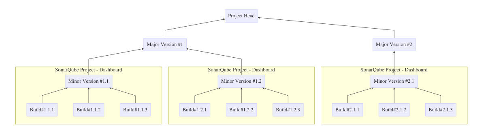

But now we want to be able to aggregate these separate minor versions into their own respective major versions which should then comprise our full project.

For these ends we have **Filters and Portfolios.**

### Portfolios

A portfolio is an multi-project dashboard which enables appending SonarQube projects, while their metrics are aggregated together to an average.

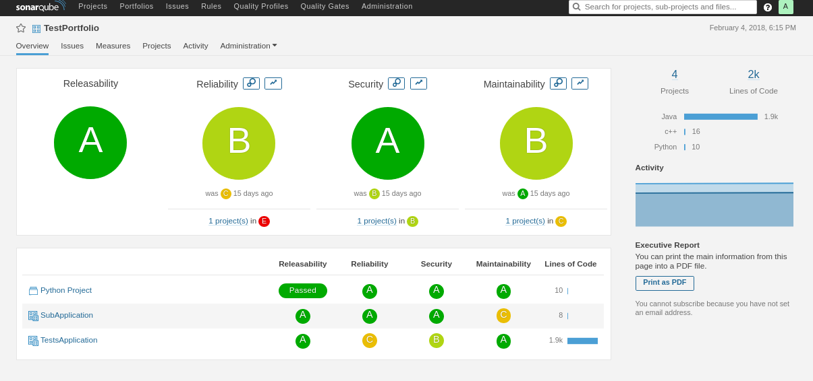

For our example we would like wrap our **Project Head** into a portfolio which will contain two sub-portfolios, one for each **Major Version** which will hold it's respective **Minor Version** projects.

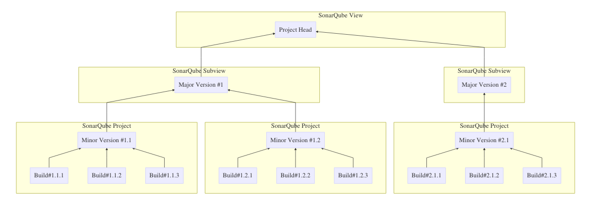

#### Adding Projects

1.  In the portfolio dashboard, go to **Administration --&gt; Edit Definition**
    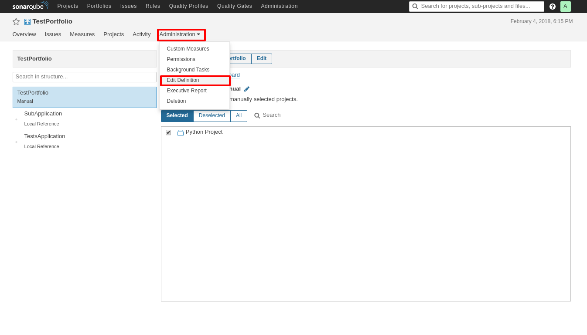

2.  Pick manual selection and select the projects you wish to add to the portfolio
    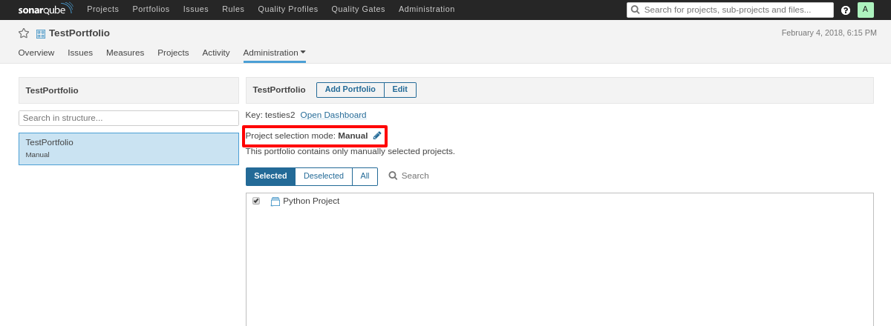

#### Creating Sub-Portfolios

1.  Select **Add Portfolio** on the Portfolio configuration page

2.  You will then be able to select whether you want to imploy a new Portfolio or aggregate an already-existing Local-Reference Portfolio.
    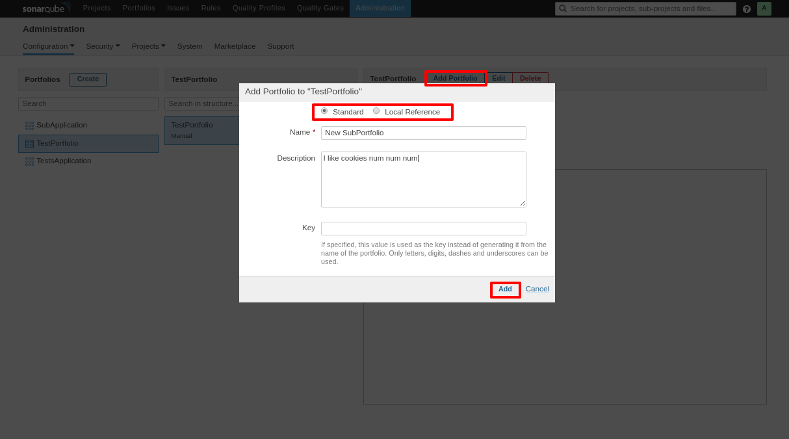

3.  Click the **Add** button to aggregate the portfolio into the currently selected one

### Filters

For occasions which require a quick overview of several projects, we can also use the filters system that enables us to filter out the correct projects by tag and output them onto a chart.

1.  In the **Projects** page, select the tags you are interested in. If you've performed the steps mentioned in the Project Structure section, you should have one for each heirarch level.
    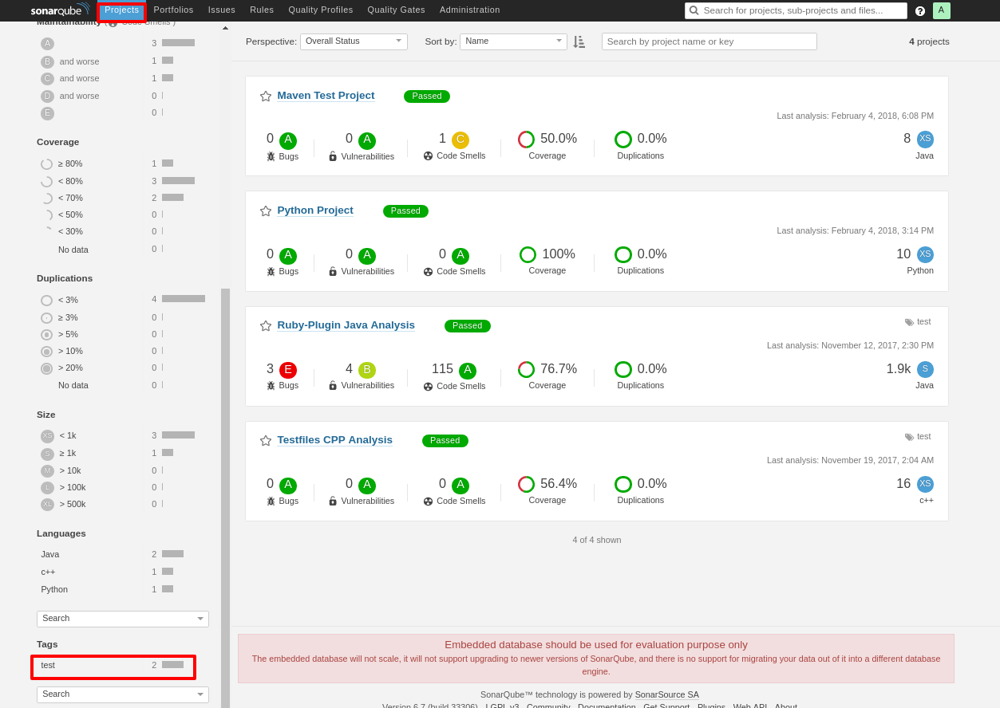

2.  You can then pick the **Coverage** option in the **Perspective** menu, to get a bubble chart dipicting the coverage quality of each tagged project in comparison.
    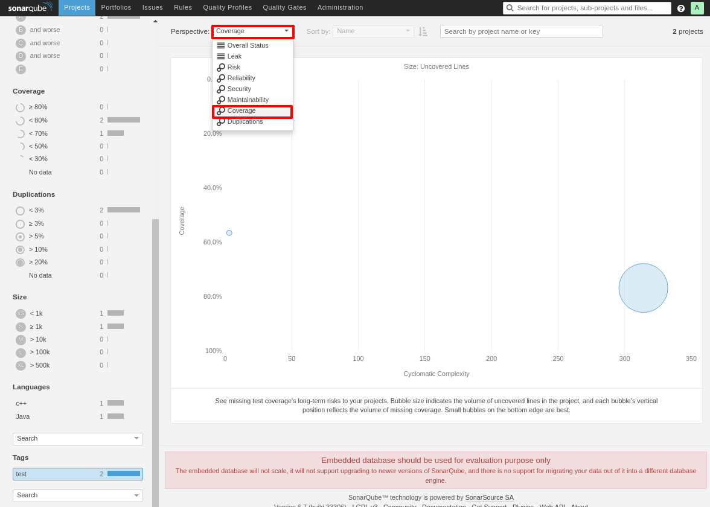

and we are done! ✨

------------------------------------------------------------------------

Security
--------

You are now able to edit project specific permissions in order to add more users by selecting **Administration -&gt; Permissions** on the project page


> ⚔ Note: Central-CI provides permissions **only** the the DevOps representative of the project, who may then create and provide more users for automation or grant LDAP users the appropriate permissions for further project maniplulation.

------------------------------------------------------------------------

PQI recommendation
------------------

After we've centralized and normalized the quality data, we are proposing the following data visualizations to give the most objective and honest depiction on the state of a product's code quality index for each hierarchical tier as seen by CCI field experts.

These are:

-   **Coverage to LOC(Lines of Code) ratio** - Gives a general indicator the the amount of attention given to test the product, although without static analysis, does not provide an assurance on quality of testing.
-   **Major versions barchart** - Provides an estimate in the improvement of product tests while progressing through major architecture changes over a product's history
-   **Coverage vs LOC treemap** - Is a very effective tool to help target hotspots and weakspots in a code's testing priorities
-   **Coverage histogram** - Not only it provides a trend of a products quality value but by comparing it to the enterprises average code quality index as well as it's gate, we can give an honest evaluation of a product in comparison to the company's moving standard.

as can be seen in the render below
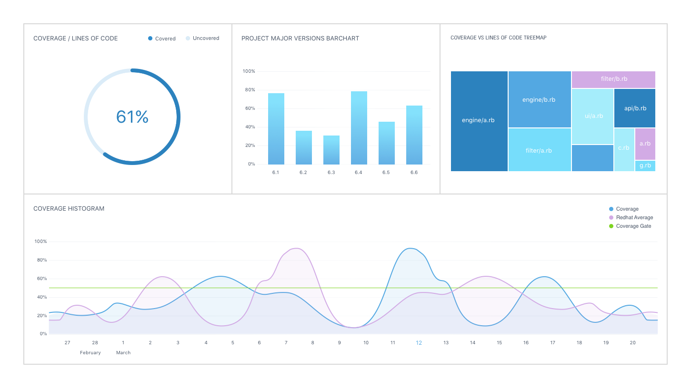
