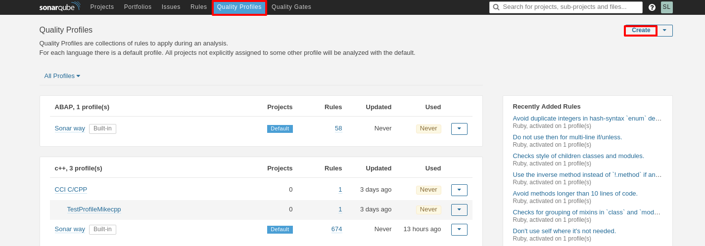
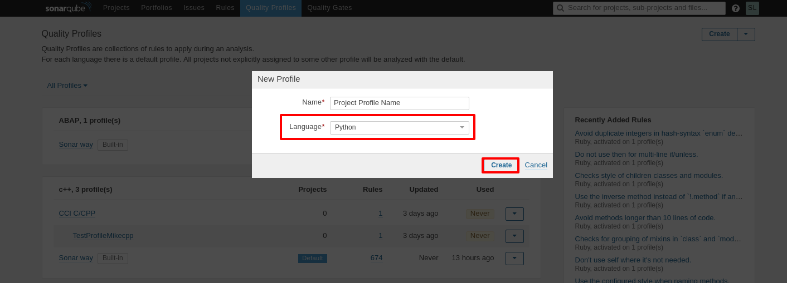
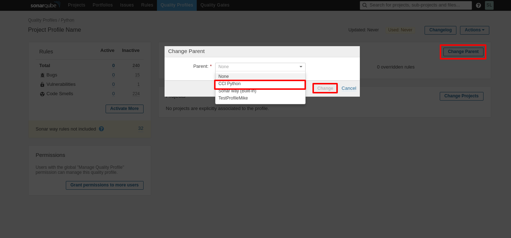
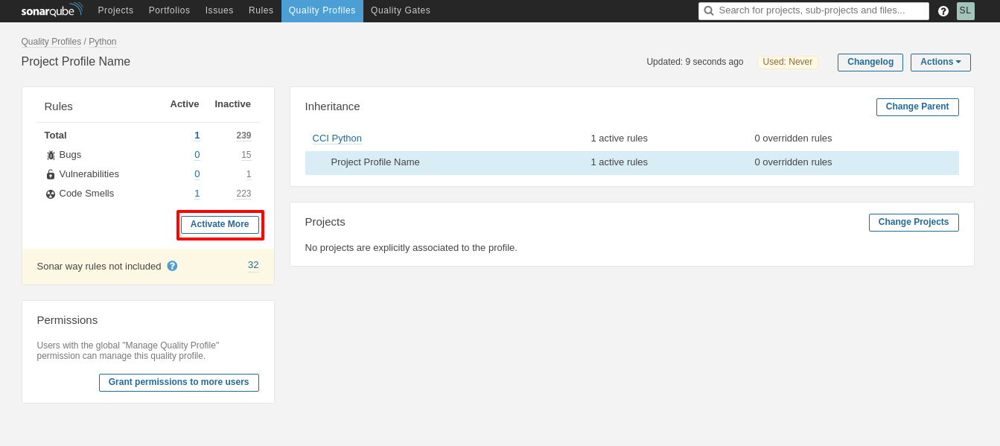
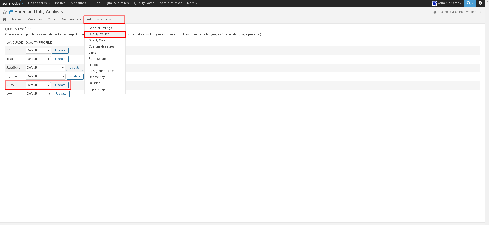
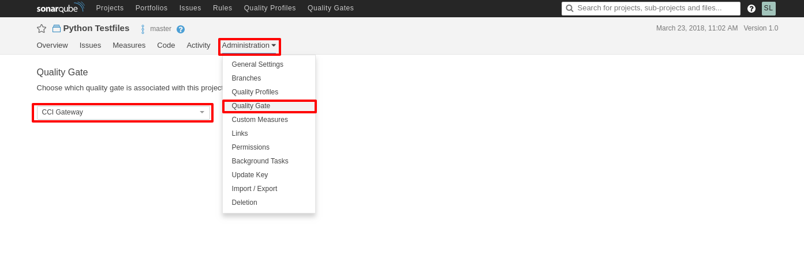

## Quality Profiles and Gates

Each SonarQube project includes an **Issues** tab which materializes SonarQube's rule system. These issues dictate the quality ranking produced for your project, as well as enabling you to manage your development and testing efforts more precisely.

### Quality Profile

The quality profile settings enlists a set of pre-configured rules which enables you to extend on those rules in order to accommodate your project needs while maintaining pre-placed standards.

> ⚔ Note: Central-CI has pre-configures a set of profiles,
representing a standard based upon expected community policies.

#### Setting and Extending a Quality Profile

1. Go to the **Quality Profiles** page and click on the **create**

2. Select the language you are analyzing and request to create your profile

3. Inherit the Central-CI profile by clicking **Change Parent** and selecting the **CCI <language>** profile

4. And you can now extend your project rules by selecting **quality_profiles.activate_more**
	
	> ⚔ Note: Every project **must** inherit the Central-CI standard
	profile as it establishes minimal requested standards.

5. Finally, in your project dashboard, go to **Administration --> Quality Profiles**, set your newly created profile and click **update**

And you are done! ✨

### Quality Gate

Each project's build is considered as either **passed** or **failed** as defined in the quality gate property of the project. A quality gate is a set of thresholds enforced over the project's evaluated rules.

> ⚔ Note: Quality gates are pre-defined by Central-CI and are automatically set as the default gateways in order to maintain conformity and stability.

#### Setting the Quality Gate

In order to set the quality gate simply go to **Administration --> Quality Gate** in your project dashboard and select the **CCI Gateway** option in the dropdown menu.

----
