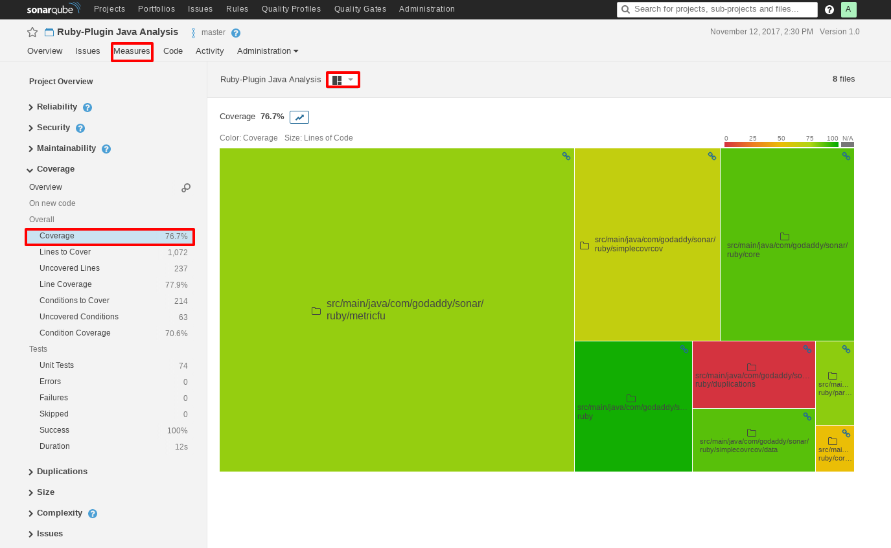
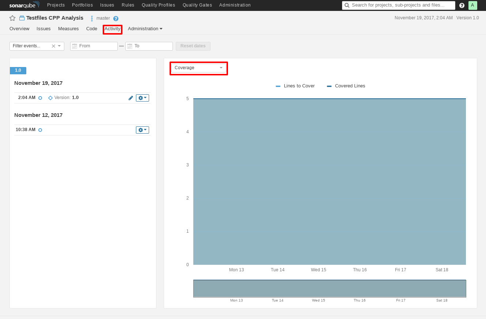

## Visualization

To be able to view your metric data and devise insights based on your results, SonarQube provides several visualization tools and charts. We will go through the basic charts, most useful for code coverage.

### Treemap

The treemap chart presents the different sub-modules of the of a single project, scaled by LOC or Complexity and colored by coverage. This enables us to recognize hot-spots lacking coverage to adjust our testing schemes for.

In order to view the treemap, on the project view, go to the **Measures** tab and on the side-panel select **Coverage** and then above the chart, select the **Treemap** option. For example:

### Activity

The activity panel enables us to view our coverage history context and visualize our project quality trends.

In order to get to the activity panel, on your project view, go to the **Activity** tab and on the top list menu, select **Coverage** to view the coverage trends. For example:

----
