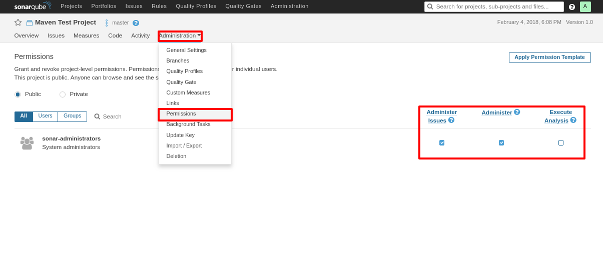

## Security

You are now able to edit project specific permissions in order to add more users by selecting **Administration -> Permissions** on the project page

> ⚔ Note: Central-CI provides permissions **only** the the DevOps representative of the project, who may then create and provide more users for automation or grant LDAP users the appropriate permissions for further project maniplulation.

----
