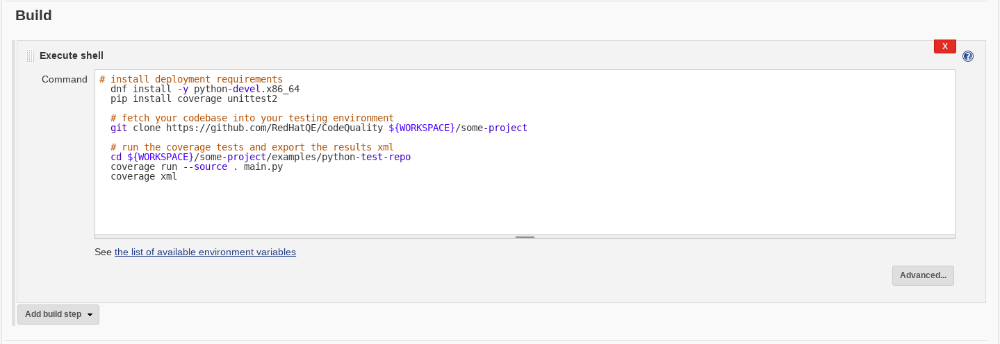
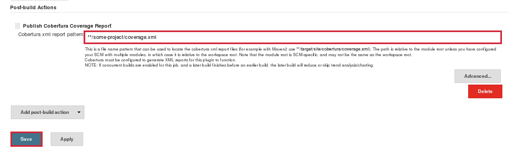
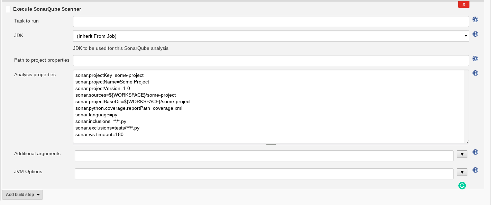

# Python Code Coverage

The following document goes through running code coverage for python, automation with Jenkins and integration with SonarQube. The code coverage tool to be used for Python is [coverage.py](http://coverage.readthedocs.io/en/latest/cmd.html)

This document is separated into 3 parts:

- **Manual Coverage** - section will present you the supported method of running code coverage on python.
- **Jenkins Automation** - section will introduce the basic steps in order to automate the coverage process using the web UI.
- **SonarQube Integration** - section will teach you how to publish your results to SonarQube using the Jenkins web UI as well as manually.

> ⚔ Note: Additional advanced topics such as covering services for integration tests or JJB configuration are covered at the bottom of the document under the **Advanced Topics** section.

## Table of Contents

<!-- TOC depthFrom:1 depthTo:4 withLinks:1 updateOnSave:1 orderedList:0 -->

- [Python Code Coverage](#python-code-coverage)
	- [Table of Contents](#table-of-contents)
	- [Manual Coverage](#manual-coverage)
		- [Prerequisites](#prerequisites)
		- [Running code coverage manually](#running-code-coverage-manually)
			- [Example](#example)
	- [Jenkins Automation](#jenkins-automation)
		- [Prerequisites](#prerequisites)
		- [Automating using the web UI](#automating-using-the-web-ui)
			- [Example](#example)
		- [Uploading coverage results to Jenkins](#uploading-coverage-results-to-jenkins)
			- [Example](#example)
	- [SonarQube Integration](#sonarqube-integration)
		- [Prerequisites](#prerequisites)
		- [Integrating SonarQube through the Jenkins web UI](#integrating-sonarqube-through-the-jenkins-web-ui)
			- [Example](#example)
		- [Publishing to SonarQube manually](#publishing-to-sonarqube-manually)
			- [Example](#example)
	- [Advanced Topics](#advanced-topics)
		- [Covering services](#covering-services)
			- [Prerequisites](#prerequisites)
			- [Implementation steps](#implementation-steps)
		- [Jenkins Job Builder](#jenkins-job-builder)
			- [Prerequisites](#prerequisites)
			- [Example](#example)

<!-- /TOC -->


 --------------------------------------------------------------------------------

## Manual Coverage

### Prerequisites

- python 2.7+
- [coverage.py](http://coverage.readthedocs.io/en/latest/cmd.html)

> ⚔ Note: notice there are several methods and tools to run code coverage such as [nose](http://nose.readthedocs.io/en/latest/), [pytest](http://doc.pytest.org/en/latest/), [pyunit](https://wiki.python.org/moin/PyUnit) as well as, [testools](https://testtools.readthedocs.io/en/latest/).
> we will only introduce one way of going about it which we have concluded to be the most suitable and straightforward for this process.

### Running code coverage manually

1. running code coverage `coverage run <somefilename.py>`

    > ⚔ Note: you can focus your coverage to specific parts of the source by using the **--include**, **--source** and **--omit** flags interchangeably. Failing to add this parameter might yield running coverage against every used package including system packages. See [Specifying source files](http://coverage.readthedocs.io/en/latest/source.html#source-execution) for details.

2. outputting the coverage data to the screen after a successful code coverage run
`coverage report`

3. exporting the report into an XML file after a successful code coverage run
`coverage xml`

    > ⚔ Note: The generated report will be in [Cobertura](http://cobertura.github.io/cobertura/) format as **required**, in order to be processed by SonarQube.

#### Example

The following example includes encountering a failure and a successful run. Let's assume you have the following 2 python files:

- **a.py**

  ```python
  def hello():
    return "Hello World"

  def world():
    return hello() + ", I'ts me!"
  ```

- **main.py**

  ```python
  import unittest
  from a import world

  class TestA(unittest.TestCase):

      def test_upper(self):
          self.assertEqual(world(), "Hello World, It's me!")

  unittest.main()
  ```

> ⚔ Note: [unittest](https://docs.python.org/2.7/library/unittest.html) or [nose](http://nose.readthedocs.io/en/latest/) are required in order to run these tests.

1. run the command `coverage run main.py`

    ```python
     F
     ======================================================================
     FAIL: test_upper (__main__.TestA)
     ----------------------------------------------------------------------
     Traceback (most recent call last):
      File "main.py", line 8, in test_upper
        self.assertEqual(world(), "Hello World, It's me!")
     AssertionError: "Hello World, I'ts me!" != "Hello World, It's me!"

     ----------------------------------------------------------------------
     Ran 1 test in 0.000s

     FAILED (failures=1)
    ```

    as you can see, we've encountered an error due to an issue that arised in our tests!

    > ⚔ Note: this issue is already resolved in the testing repository in order to simplify tthe implementation if this example.

    _we can see the following indicators:_

    - F - for a failed test
    - E - for an error occurring during a test
    - dot(.) - for a successful test

      **Now that we've fixed the problem, you can see our tests running successfully!**

    ```python
    .
    --------------------------------------------------------------------------------

    Ran 1 test in 0.000s

    OK
      ```

    you can now run the command `coverage report` which would output the coverage data collected like so:

    ```python
     Name      Stmts   Miss  Cover
     -----------------------------
     a.py          4      0   100%
     main.py       6      0   100%
     -----------------------------
     TOTAL        10      0   100%
    ```

2. finally, you can export this report into an XML file by running the command `coverage xml`, creating the file `coverage.xml` in the current working directory.

--------------------------------------------------------------------------------

## Jenkins Automation

### Prerequisites

- [Jenkins v1.653+](https://jenkins.io/)
- [Cobertura plugin v1.9.8+](https://wiki.jenkins-ci.org/display/JENKINS/Cobertura+Plugin)
- testing environment running:

  - fedora v23
  - Java v8+
  - git

  > ⚔ Note: you could either use a provisioning system such as [docker daemon](https://docs.docker.com/engine/reference/commandline/dockerd/), [OpenShift](https://github.com/openshift), [OpenStack](https://github.com/openstack), [Kubernetes](https://kubernetes.io/), etc. or use a local environment.

> ⚔ Note: notice there are several methods and tools to manage CI and automation such as [Gump](https://gump.apache.org/), [Hudson](http://hudson-ci.org/), [Bamboo](https://www.atlassian.com/software/bamboo), [Travis](https://travis-ci.org/) and more. We will only introduce and support Jenkins for this end as it is the standardized CI tool in RedHat.

### Automating using the web UI

Continuing from the previous chapter, assuming our project files are held on a remote github repository **[https://github.com/RedHatQE/CodeQuality/tree/master/examples/python-test-repo](https://github.com/RedHatQE/CodeQuality/tree/master/examples/python-test-repo)**.

#### Example

1. in the main Jenkins page, click to `New Item` button to create a new job

    

2. name your job, select the `Freestyle Project` radio button and save the new job

    

3. on the newly opened screen, scroll down and create a new bash script build step

    

4. paste the following deployment script onto the bash text editor

    ```shell
     # install deployment requirements
     dnf install -y python-devel.x86_64
     pip install coverage unittest2

     # fetch your codebase into your testing environment
     git clone https://github.com/RedHatQE/CodeQuality ${WORKSPACE}/some-project

     # run the coverage tests and export the results xml
     cd ${WORKSPACE}/some-project/examples/python-test-repo
     coverage run --source . main.py
     coverage xml
    ```

    > ⚔ Note: the **-y** parameter in the dnf command approves installation prompts which is mandatory for automation purposes.

    > ⚔ Note: the **${WORKSPACE}** environment variable is used by Jenkins in order to point to the current build's working directory

    

    let's have a look for a moment at our script, we can see it's divided into 3 main parts:

    - installation of prerequisites
    - fetching the code base
    - running our tests with coverage to create a report (as seen on the previous chapter)

      > ⚔ Note: in most cases, each of these parts will be more complicated and it's a good habit to break each part into it's own bash build step to ease troubleshooting

5. run a build of our newly created job

    

  **And we're done!** on the next chapter you will learn how to publish your generated results into SonarQube to view them.

### Uploading coverage results to Jenkins

Sometimes it's useful to have your coverage results uploaded to your Jenkins job which could ease troubleshooting procceses in case of large scale development efforts which might require several independant coverage jobs.
For that purpose, we will use the [Jenkins Cobertura plugin](https://wiki.jenkins-ci.org/display/JENKINS/Cobertura+Plugin) in order to preview this results in our job's web UI.

#### Example

Continuing from the previous section, assuming our newly created job has generated a coverage report onto `${WORKSPACE}/some-project/coverage.xml`.

1. in the job's configuration screen, add a post-build action to publish to Cobertura

    

2. input a relative glob path to the generated report path and save the job

    ```shell
     **/some-project/coverage.xml
    ```

    

3. after rerunning our job you will be able to view the report's preview in your job's main screen

    

--------------------------------------------------------------------------------

## SonarQube Integration

### Prerequisites

- [Jenkins v1.653+](https://jenkins.io/)
- [SonarQube v5.6.3 LTS](https://docs.sonarqube.org/display/SONAR/Setup+and+Upgrade)
- [SonarQube Runner v2.6+](https://docs.sonarqube.org/display/SCAN/Analyzing+with+SonarQube+Scanner)

> ⚔ Note: in order to deploy a SonarQube instance, you can refer to the [Installing Sonar Server v6.0.7](../../deployments) document

> ⚔ Note: for Jenkins Sonar plugin configuration see [Analyzing with SonarQube Scanner for Jenkins](https://docs.sonarqube.org/display/SCAN/Analyzing+with+SonarQube+Scanner+for+Jenkins) for details.

### Integrating SonarQube through the Jenkins web UI

As a direct continuation of the previous chapter, building on the same Jenkins job, we'll now add the SonarQube integration.

#### Example

1. in the job configuration, add a sonar runner builder

    

2. paste your sonar parameters onto the text editor and save the job

    

    Now let's have a look at these parameters:

    ```shell
     # projectKey (string): SonarQube project identification key (unique)
     sonar.projectKey=some-project

     # projectName (string): SonarQube project name (NOT unique)
     sonar.projectName=Some Project

     # projectVersion (decimal): The analyzed project version (unique)
     sonar.projectVersion=1.0

     # sources (string): source code home directory
     sonar.sources=${WORKSPACE}/some-project

     # projectBaseDir (string): project home directory (same as sources)
     sonar.projectBaseDir=${WORKSPACE}/some-project

     # python.coverage.reportPath (string): relative coverage report file path
     sonar.python.coverage.reportPath=coverage.xml

     # language (string): project language(py)
     sonar.language=py

     # inclusions (string): file inclusion pattern
     sonar.inclusions=**/*.py

     # exclusions (string): file exclusion pattern
     sonar.exclusions=tests/**/*.py

     # ws.timeout (int): optional connection timeout parameter
     sonar.ws.timeout=180
    ```

    > ⚔ Note: for further details on SonarQube analysis parameters, see [Analysis Parameters](https://docs.sonarqube.org/display/SONAR/Analysis+Parameters).

3. run a build again to view the reported results

    

    you'd now be able to see a link to the results on the job's page which will lead you to the SonarQube dashboard.

    

    **And we are done!** you will now have a link to the published SonarQube report dashboard

    

### Publishing to SonarQube manually

Sometimes it's useful to be able to publish our coverage report to SonarQube manually. Although it is **not a recommended** methodology, we will elaborate upon the needed steps for those ends.

> ⚔ Note: in this section we assume you are running an up-to-date RedHat distribution(Fedora, CentOS, RHEL)

#### Example

As a continuation of the previous examples and assuming our generated coverage report is located at `/some-project/coverage.xml`

> ⚔ Note: The generated report **must** be in Cobertura format in order to be processed by SonarQube.

1. install [v2.6+ of SonarRunner](https://github.com/SonarSource/sonar-scanner-cli/releases), which is the client agent for the SonarQube server by running the following commands

    ```shell
     wget https://github.com/SonarSource/sonar-scanner-cli/releases/download/2.6-rc1/sonar-scanner-2.6-SNAPSHOT.zip
     unzip sonar-scanner-2.6-SNAPSHOT.zip
    ```

2. now, in addition to our previous scanning parameters while publishing to sonar through the Jenkins UI:

    ```shell
     # projectKey (string): SonarQube project identification key (unique)
     sonar.projectKey=some-project

     # projectName (string): SonarQube project name (NOT unique)
     sonar.projectName=Some Project

     # projectVersion (decimal): The analyzed project version (unique)
     sonar.projectVersion=1.0

     # sources (string): source code home directory
     sonar.sources=${WORKSPACE}/some-project

     # projectBaseDir (string): project home directory (same as sources)
     sonar.projectBaseDir=${WORKSPACE}/some-project

     # python.coverage.reportPath (string): relative coverage report file path
     sonar.python.coverage.reportPath=coverage.xml

     # language (string): project language(py)
     sonar.language=py

     # inclusions (string): file inclusion pattern
     sonar.inclusions=**/*.py

     # exclusions (string): file exclusion pattern
     sonar.exclusions=tests/**/*.py

     # ws.timeout (int): optional connection timeout parameter
     sonar.ws.timeout=180
    ```

    we will now also include the SonarServer URL, in this example we are using the CentralCI test-lab instance:

    ```shell
     # host.url (string): the URL pointing to the SonarServer instance
     sonar.host.url=http://sonar_server_address:9000
    ```

    all together, our final command should look as follows:

    ```shell
     sonar-scanner-2.6-SNAPSHOT/bin/sonar-scanner -X -e\
         -Dsonar.host.url=http://sonar_server_address\
         -Dsonar.projectKey=some-project\
         "-Dsonar.projectName=Some Project"\
         -Dsonar.projectVersion=1.0\
         -Dsonar.sources=${WORKSPACE}/some-project\
         -Dsonar.projectBaseDir=${WORKSPACE}/some-project\
         -Dsonar.python.coverage.reportPath=coverage.xml\
         -Dsonar.language=py\
         "-Dsonar.inclusions=**/*.py"\
         "-Dsonar.exclusions=tests/**/*.py"\
         -Dsonar.ws.timeout=180\
    ```

    > ⚔ Note: we have parenthesized parameters which include white-space and special characters

    > ⚔ Note: the **-X -e** flags are used to verbose and prompt runtime issues with the SonarScanner

3. finally, you should be able to see a success prompt with a link to your published coverage report dashboard such as this one:

    ```shell
     DEBUG: Upload report
     DEBUG: POST 200 http://sonar_server_address/api/ce/submit?projectKey=some-project&projectName=Some%20Project | time=34ms
     INFO: Analysis report uploaded in 41ms
     INFO: ANALYSIS SUCCESSFUL, you can browse http://sonar_server_address/dashboard/index/some-project
     INFO: Note that you will be able to access the updated dashboard once the server has processed the submitted analysis report
     INFO: More about the report processing at http://sonar_server_address/api/ce/task?id=AVpaB5_70YnVK7Pmb1mm
     DEBUG: Report metadata written to /some-project/.sonar/report-task.txt
     DEBUG: Post-jobs :
     INFO: ------------------------------------------------------------------------
     INFO: EXECUTION SUCCESS
     INFO: ------------------------------------------------------------------------
     INFO: Total time: 8.900s
     INFO: Final Memory: 51M/235M
     INFO: ------------------------------------------------------------------------
    ```

    **and your results have been published! (:**

--------------------------------------------------------------------------------

## Advanced Topics

### Covering services

In order to run coverage over a service or a process not launched manually from it's entry-point i.e multi-service products, API integration tests, multi-host integration tests, etc.<br>
We are proposing the following solution, which inserts a pipeline hook to each python process.

> ⚔ Note: This process has been tested and is supporting bot multi-processing as well as multi-threading

#### Prerequisites

- python 2.7+
- [coverage.py](http://coverage.readthedocs.io/en/latest/cmd.html)

#### Implementation steps

In order to run coverage over a service you must first configure your environment as follows.

1. create a file called `sitecustomize.py` at the `site-packages` directory, commonly located in `/usr/lib/python2.7`, containing:

    ```python
     import coverage
     coverage.process_startup()
    ```

    > ⚔ Note: This methodology uses the `site` module. In order to list it's paths, run `python -m site`. For more details see [Site-wide Configuration](https://pymotw.com/2/site/#module-sitecustomize).

2. create a `.coveragerc` configuration file wherever you'd like, containing:

    ```ini
     [run]
     source={source files directory path}
     data_file={results directory path}/.coverage
     parallel=true
     concurrency=multiprocessing

     [xml]
     output={results directory path}/coverage.xml
    ```

    Notice this ini file is divided into coverage run parameters and report relevant parameters. other then setting the source and output directories, we've also set the parallel and concurrency parameters.

    - parallel: whether to set a unique name for each generated report in cases of parallelism
    - concurrency: which concurrency library is used

      > ⚔ Note: We've used the `multiprocessing` module for concurrency, within our application and this parameter should be adapted for you scenario. For more information, see [Configuration Files](http://coverage.readthedocs.io/en/coverage-4.2/config.html#run).

      > ⚔ Warning: Not setting `source` might result in a system-wide python process coverage.

  * create a `results` folder

  After this configuration, you should perform the following actions:

  1. set the environment variable `COVERAGE_PROCESS_START` to the `.coveragerc` file we created

      ```shell
       export COVERAGE_PROCESS_START={path to .coveragerc file}
      ```

      Before each process is being executed, the `COVERAGE_PROCESS_START` will be sampled. If the variable is set to a configuration file then these settings will be used for the coverage, otherwise, the default configuration will be used.

      > ⚔ Note: You could also set `COVERAGE_PROCESS_START` in your `.bashrc` if you wish for coverage to run contentiously.

  2. as mentioned above, this hook is ran **before** the process is launched, hence we need to restart the service

      ```shell
      systemctl restart {service name}
      ```

  3. after the service have shut down gracefully, you should be able to find your coverage results in the results folder. go to the `results` directory and combine the results generated into a single report

      ```shell
      cd {results directory path}
      coverage combine
      ```

      > ⚔ Note: This step is only relevant for cases using parallelism, single-process cases will only have a single file within the `results` folder.

You should now have a `.coverage` report file in your `results directory` and we are done!

### Jenkinsfile

Starting with Jenkins 2, automation configuration can mainitained using a Jenkinsfile
which levrages the power of Grooveyscript to describe a jenkins job.

#### Prerequisites

- [Jenkins v2.6+](https://jenkins.io/)
- [Jenkins Pipeline Plugin v2.5+](https://wiki.jenkins.io/display/JENKINS/Pipeline+Plugin)

> ⚔ Note: For more details on the Jenkinsfile format, see [Using a Jenkinsfile](https://jenkins.io/doc/book/pipeline/jenkinsfile/)

#### Example

The following file illustrates a possible Jenkinsfile configuration

```groovey
pipeline {
    agent { node { label 'ssh_slave' } }
    options {
      skipDefaultCheckout true
    }
    triggers {
      cron('0 8 * * *')
    }
    stages {
        stage('Deploy') {
            steps {
                // clone project and install dependencies
                git url: 'https://github.com/RedHatQE/CodeQuality.git'
                sh 'dnf install -y python2-devel.x86_64'
                sh 'pip install coverage unittest2'
            }
        }
        stage('Analyse') {
            steps {
                dir('examples/python-test-repo') {
                // run tests with coverage and export results to xml
                sh 'coverage run --source . main.py'
                sh 'coverage xml'
                }
            }
        }
        stage('Report') {
            /*
            sonar runner parameters, set sources and baseDir to project home
            ========================

            projectKey (string): SonarQube project identification key (unique)
            projectName (string): SonarQube project name (NOT unique)
            projectVersion (string): SonarQube project version (unique)
            sources (string): source code home directory
            projectBaseDir (string): project home directory (same as sources)
            python.coverage (string): relative xml coverage report path
            language (string): project language(py)
            inclusions (string): file inclusion pattern
            exclusions (string): file exclusion pattern
            login (string): SonarQube server user name
            password (string): SonarQube server user password
             */
            steps {
              writeFile file: "${pwd()}/sonar-project.properties", text: """
              sonar.projectKey=test-files_1_0_python_full-analysis
              sonar.projectName=Python Testfiles
              sonar.projectVersion=1.0
              sonar.sources=${pwd()}/examples/python-test-repo
              sonar.projectBaseDir=${pwd()}/examples/python-test-repo
              sonar.python.coverage.reportPath=${pwd()}/examples/python-test-repo/coverage.xml
              sonar.language=py
              sonar.inclusions=**/*.py
              sonar.exclusions=tests/**/*.py
              sonar.login=test
              sonar.password=test
              sonar.ws.timeout=180
              """

              // initite pre-configured sonar scanner tool on project
              // 'sonarqube_prod' is our cnfigured tool name, see yours
              // in the Jenkins tool configuration
              withSonarQubeEnv('sonarqube_prod') {
                sh "${tool 'sonar-scanner-2.8'}/bin/sonar-scanner"

              }
            }
        }
    }
}

```

### Jenkins Job Builder

Jenkins automation configuration can also be done by using the Jenkins Job builder (JJB)
which takes simple descriptions of Jenkins jobs in YAML or JSON format and uses them to configure Jenkins.

#### Prerequisites

- [Jenkins v1.653+](https://jenkins.io/)
- [Jenkins Job Builder v2.0+](https://docs.openstack.org/infra/jenkins-job-builder/)

> ⚔ Note: For more details on installing and configuring JJB, see the [Quick Start Guide](https://docs.openstack.org/infra/jenkins-job-builder/)

#### Example

The following file illustrates a possible JJB configuration

```yaml
- job:
    name: sonarqube_pulp_python_full_analysis

    #######################################################
    ############## SonarQube Parameters ###################
    #######################################################

    # sonarqube project parameters, set before build
    parameters:
      - string:
          name: SONAR_KEY
          default: sonarqube_pulp_python_full_analysis
          description: "SonarQube unique project key"
      - string:
          name: SONAR_NAME
          default: Pulp Python Analysis
          description: "SonarQube project name"
      - string:
          name: SONAR_PROJECT_VERSION
          default: "1.0"
          description: "SonarQube project version"

    #######################################################
    ################### Slave Image #######################
    #######################################################

    node: ssh_slave

    #######################################################
    ################ Git Trigger Config ###################
    #######################################################

    # git repo to follow, skip-tag to not require auth
    scm:
      - git:
          url: https://github.com/pulp/pulp.git
          branches:
            - 2.11-dev
          skip-tag: true

    # git polling trigger set to once an hour
    triggers:
      - pollscm:
          cron: "H */1 * * *"
          ignore-post-commit-hooks: True

    #######################################################
    ################### Build Steps #######################
    #######################################################

    builders:

      # project deployment script goes here
      - shell: |
          # install dependencies
          dnf install -y wget python-devel.x86_64 rpm-build

          # deployment command to install pulp testing requirements
          rpmspec -q --queryformat '[%{REQUIRENAME}\n]' *.spec |\
                grep -v "/.*" | grep -v "python-pulp.* " | grep -v "pulp.*" |\
                uniq | xargs -I {} dnf install -y --allowerasing {} || true

          pip install -r test_requirements.txt

          # install project
          python devel/setup.py install || true

          # remove lines calling on `systemctl` as they are not needed
          # inside a docker container environment
          sed -i '400,401d;435,437d' pulp-dev.py
          python ./pulp-dev.py -I || true

      # coverage tests initialization script
      - shell: |
          python run-tests.py --enable-coverage || true
          coverage xml

      # sonar runner parameters, set sources and baseDir to project home
      # projectKey (string): SonarQube project identification key (unique)
      # projectName (string): SonarQube project name (NOT unique)
      # projectVersion (string): Analyzed project version (unique)
      # sources (string): source code home directory
      # projectBaseDir (string): project home directory (same as sources)
      # language (string): project language(ruby)
      # inclusions (string): file inclusion pattern
      # exclusions (string): file exclusion pattern
      - sonar:
          sonar-name: sonarqube_prod
          properties: |
            sonar.projectKey=$SONAR_KEY
            sonar.projectName=$SONAR_NAME
            sonar.projectVersion=$SONAR_PROJECT_VERSION
            sonar.sources=${WORKSPACE}
            sonar.projectBaseDir=${WORKSPACE}
            sonar.python.coverage.reportPath=coverage.xml
            sonar.language=py
            sonar.inclusions=**/*.py
            sonar.exclusions=tests/**/*.py
            sonar.ws.timeout=180
```
