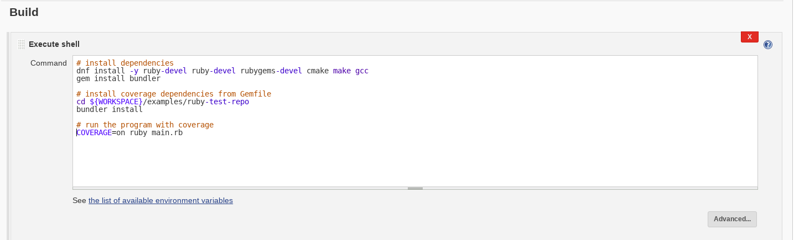
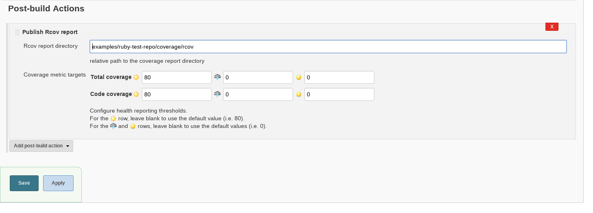
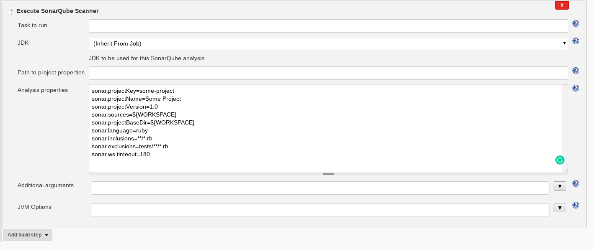

# Ruby Code Coverage

The following document goes through running code coverage for Ruby, automation with Jenkins and integration with SonarQube. The code coverage tool to be used for [Ruby](https://www.ruby-lang.org/en) is [SimpleCov](https://github.com/colszowka/simplecov), which is based on [Coverage](http://ruby-doc.org/stdlib-2.1.0/libdoc/coverage/rdoc/Coverage.html) and the [SimpleCov-Rcov](https://github.com/fguillen/simplecov-rcov) and [SimpleCov-Console](https://github.com/chetan/simplecov-console) formatters.

This document is separated into 3 parts:
* **Manual Coverage** - section will present you the supported method of running code coverage on Ruby.
* **Jenkins Automation** - section will introduce the
basic steps in order to automate the coverage process using the web UI.
* **SonarQube Integration** - section will teach you how to publish your results to SonarQube using the Jenkins web UI as well as manually.

> ⚔ Note: Additional advanced topics such as JJB configuration are covered at the bottom of the document under the **Advanced Topics** section.

## Table of Contents

<!-- TOC depthFrom:1 depthTo:4 withLinks:1 updateOnSave:1 orderedList:0 -->

- [Ruby Code Coverage](#ruby-code-coverage)
	- [Table of Contents](#table-of-contents)
	- [Manual Coverage](#manual-coverage)
		- [Prerequisites](#prerequisites)
		- [Running code coverage manually](#running-code-coverage-manually)
			- [Example](#example)
	- [Jenkins Automation](#jenkins-automation)
		- [Prerequisites](#prerequisites)
		- [Automating using the web UI](#automating-using-the-web-ui)
			- [Example](#example)
		- [Uploading coverage results to Jenkins](#uploading-coverage-results-to-jenkins)
			- [Example](#example)
	- [SonarQube Integration](#sonarqube-integration)
		- [Prerequisites](#prerequisites)
		- [Integrating SonarQube through the Jenkins web UI](#integrating-sonarqube-through-the-jenkins-web-ui)
			- [Example](#example)
		- [Publishing to SonarQube manually](#publishing-to-sonarqube-manually)
			- [Example](#example)
	- [Advanced Topics](#advanced-topics)
		- [Jenkins Job Builder](#jenkins-job-builder)
			- [Prerequisites](#prerequisites)
			- [Example](#example)

<!-- /TOC -->

--------------------------------------------------------------------------------

## Manual Coverage

### Prerequisites

- [Ruby 2.3+](https://www.ruby-lang.org/en)
- [SimpleCov](https://github.com/colszowka/simplecov)
	- [SimpleCov-Rcov](https://github.com/fguillen/simplecov-rcov)
	- [SimpleCov-Console](https://github.com/chetan/simplecov-console)

> ⚔ Note: notice there are several methods and tools to run code coverage such as [Test::Unit](http://ruby-doc.org/stdlib-2.0.0/libdoc/test/unit/rdoc/Test/Unit.html), [Coverage](http://ruby-doc.org/stdlib-2.1.0/libdoc/coverage/rdoc/Coverage.html), [RSpec](http://rspec.info/) and [Cucumber](https://cucumber.io/), we will only introduce one way of going about it which we have concluded to be the most suitable and straightforward for this process.

### Running code coverage manually

1. including the required modules to your `Gemfile`
	 ```ruby
	 gem 'simplecov', '~> 0.9'
	 gem 'simplecov-rcov', :require => false
	 gem 'simplecov-console'
	 ```

2. adding SimpleCov configuration to your entry point
   ```ruby
	 if ENV['COVERAGE'] == 'on'

	    # Include requirements
	    require 'simplecov'
	    require 'simplecov-rcov'
	    require 'simplecov-console'

	    # Set formatter as rcov to support third-party plugin
	    SimpleCov.formatter = SimpleCov::Formatter::MultiFormatter[
	      SimpleCov::Formatter::RcovFormatter,
	      SimpleCov::Formatter::Console,
	    ]
	    SimpleCov.start
		end
	 ```

	 > ⚔ Note: we have used `ENV['COVERAGE']` in order to activate coverage reporting for coverage test tiers only.


3. running the program with coverage
  `COVERAGE=on ruby <entry-point-file.rb>`

    > ⚔ Note: for inclusion patterns and more advanced configuration options, see the [API Documentation](http://www.rubydoc.info/gems/simplecov/frames)

4. coverage reports can be found in the `coverage` directory at the working directory

#### Example

The following example includes encountering a failure and a successful run.

> ⚔ Note: [Test::Unit](http://ruby-doc.org/stdlib-2.0.0/libdoc/test/unit/rdoc/Test/Unit.html) is required in order to run these tests.

Let's assume you have the following 2 ruby files and an additional Gemfile:

- **Gemfile**

	```ruby
	source "https://rubygems.org"
	gem 'test-unit'
	gem 'simplecov', '~> 0.9'
	gem 'simplecov-rcov', :require => false
	gem 'simplecov-console'
	```

- **a.rb**

  ```ruby
	def hello(name)
	  "Hello world, i'ts #{name}"
	end
  ```

- **main.rb**

  ```ruby
	# Run simplecov code coverage for sonar integration
	if ENV['COVERAGE'] == 'on'

	    # Include requirements
	    require 'simplecov'
	    require 'simplecov-rcov'
	    require 'simplecov-console'

	    # Set formatter as rcov to support third-party plugin
	    SimpleCov.formatter = SimpleCov::Formatter::MultiFormatter[
	      SimpleCov::Formatter::RcovFormatter,
	      SimpleCov::Formatter::Console,
	    ]
	    SimpleCov.start
	end

	# Include required files and test suite
	require_relative 'a'
	require 'test/unit'

	# Test the 'hello' function
	class TestHello < Test::Unit::TestCase
	    def test_function
	        assert_equal("Hello world, it's Bob", hello('Bob'))
	    end
	end
  ```
> ⚔ Note: We are using an environment variable `COVERAGE` in order to initiate coverage reporting conditionally in cases where the coverage runtime overhead might hinder regular code analysis.

> ⚔ Note: `SimpleCov.formatter` is used in order to set our formatters. `Console` for command line preview and `Rcov` for Jenkins and Sonar publishing. for futher details, see [SimpleCov Documentation](http://www.rubydoc.info/gems/simplecov).

> ⚔ Note: If you encounter any issues involving missing Ruby headers, try to install `ruby-devel,  rubygems-devel and redhat-rpm-config`, for more information, see the [Ruby Installation Documentation](https://www.ruby-lang.org/en/documentation).

1. use the ruby `bundler` in order to install the required gems
	```shell
	bundler install
	```

2. run the command `COVERAGE=on ruby main.rb`

		```python

					Started
					F
					==========================================================================================================================================
					Failure: test_function(TestHello)
					main.rb:22:in `test_function'
					     19:
					     20: class TestHello < Test::Unit::TestCase
					     21:     def test_function
					  => 22:         assert_equal("Hello world, it's Bob", hello('Bob'))
					     23:     end
					     24: end
					<"Hello world, it's Bob"> expected but was
					<"Hello world, i'ts Bob">

					diff:
					? Hello world, i't's Bob
					==========================================================================================================================================


					Finished in 0.007235294 seconds.
					------------------------------------------------------------------------------------------------------------------------------------------------
					1 tests, 1 assertions, 1 failures, 0 errors, 0 pendings, 0 omissions, 0 notifications
					0% passed
					------------------------------------------------------------------------------------------------------------------------------------------------
					138.21 tests/s, 138.21 assertions/s
					Coverage report Rcov style generated for Unit Tests to ruby_coverage_testfiles/coverage/rcov

					COVERAGE:  75.00% -- 3/4 lines in 1 files

					+----------+------+-------+--------+---------+
					| coverage | file | lines | missed | missing |
					+----------+------+-------+--------+---------+
					|  75.00%  | a.rb | 4     | 1      | 3       |
					+----------+------+-------+--------+---------+

		```

as you can see, we've encountered an error due to an issue that arised in our tests!

_we can see the following indicators:_

  - F - for a failed test
  - E - for an error occurring during a test
  - dot(.) - for a successful test  

    **Now that we've fixed the problem, you can see our tests running successfully!**

    ```python
	Started
	.

	Finished in 0.000478008 seconds.
	------------------------------------------------------------------------------------------------------------------------------------------------
	1 tests, 1 assertions, 0 failures, 0 errors, 0 pendings, 0 omissions, 0 notifications
	100% passed
	------------------------------------------------------------------------------------------------------------------------------------------------
	2092.02 tests/s, 2092.02 assertions/s
	Coverage report Rcov style generated for Unit Tests to ruby_coverage_testfiles/coverage/rcov

	COVERAGE:  75.00% -- 3/4 lines in 1 files

	+----------+------+-------+--------+---------+
	| coverage | file | lines | missed | missing |
	+----------+------+-------+--------+---------+
	|  75.00%  | a.rb | 4     | 1      | 3       |
	+----------+------+-------+--------+---------+
    ```

	> ⚔ Note: Notice we haven't reached maximum coverage due to the conditional in the `a.rb` file.

3. you can now view the report file `.resultset.json` in the `coverage` directory in the current working directory **and we are done! (:**

--------------------------------------------------------------------------------

## Jenkins Automation

### Prerequisites

- [Jenkins v1.653+](https://jenkins.io/)
- [RubyMetrics plugin for Jenkins v1.6.5+](https://wiki.jenkins-ci.org/display/JENKINS/RubyMetrics+plugin)
- testing environment running:

  - fedora v23
  - Java v8+
  - git

  > ⚔ Note: you could either use a provisioning system such as [docker daemon](https://docs.docker.com/engine/reference/commandline/dockerd/), [OpenShift](https://github.com/openshift), [OpenStack](https://github.com/openstack), [Kubernetes](https://kubernetes.io/), etc. or use a local environment.

> ⚔ Note: notice there are several methods and tools to manage CI and automation such as [Gump](https://gump.apache.org/), [Hudson](http://hudson-ci.org/), [Bamboo](https://www.atlassian.com/software/bamboo), [Travis](https://travis-ci.org/) and more. We will only introduce and support Jenkins for this end as it is the standardized CI tool in RedHat.

### Automating using the web UI

Continuing from the previous chapter, assuming our project files are held on a remote github repository [https://github.com/RedHatQE/CodeQuality/tree/master/examples/ruby-test-repo](https://github.com/RedHatQE/CodeQuality/tree/master/examples/ruby-test-repo).

#### Example

1. in the main Jenkins page, click to `New Item` button to create a new job

    

2. name your job, select the `Freestyle Project` radio button and save the new job

    

3. on the newly opened screen, set the `Source Code Management` to git and fill in our repository

	

3. scroll down, click `Add build step` and select `Execute shell` to create a new bash script build step

    

4. paste the following deployment script onto the bash text editor

    ```shell
		# install dependencies
		dnf install -y ruby-devel ruby-devel rubygems-devel cmake make gcc
		gem install bundler

		# install coverage dependencies from Gemfile
		cd ${WORKSPACE}/examples/ruby-test-repo
		bundler install

		# run the program with coverage
		COVERAGE=on ruby main.rb
    ```

	> ⚔ Note: we are using Fedora v23+, if you are using a older version or a different redhat distribution, you might want to try 'yum' instead of 'dnf'

  > ⚔ Note: the **-y** parameter in the dnf command approves installation prompts which is mandatory for automation purposes.  

  > ⚔ Note: the **${WORKSPACE}** environment variable is used by Jenkins in order to point to the current build's working directory

    

    let's have a look for a moment at our script, we can see it's divided into 3 main parts:

    - installation of prerequisites
    - running our tests with coverage to create a report (as seen on the previous chapter)

    > ⚔ Note: in most cases, each of these parts will be more complicated and it's a good habit to break each part into it's own bash build step to ease troubleshooting

5. run a build of our newly created job

    

    **And we're done!** on the next chapter you will learn how to publish your generated results into SonarQube to view them.

### Uploading coverage results to Jenkins

Sometimes it's useful to have your coverage results uploaded to your Jenkins job which could ease troubleshooting procceses in case of large scale development efforts which might require several independant coverage jobs.

For that purpose, we will use the [RubyMetrics plugin for Jenkins](https://wiki.jenkins-ci.org/display/JENKINS/RubyMetrics+plugin) in order to preview this results in our job's web UI.

#### Example

Continuing from the previous section, assuming our newly created job has generated a coverage report into `${WORKSPACE}/examples/ruby-test-repo/coverage/rcov`.

1. in the job's configuration screen, add a post-build action to publish the Rcov report

	

2. input a relative path to the generated report path and save the job

	```shell
	examples/ruby-test-repo/coverage/rcov
	```

	

3. after rerunning our job you will be able to view the report's preview in your job's main screen

	

--------------------------------------------------------------------------------

## SonarQube Integration

### Prerequisites

  - [Jenkins v1.653+](https://jenkins.io/)
  - [SonarQube v5.6.3 LTS](https://docs.sonarqube.org/display/SONAR/Setup+and+Upgrade)
	  - [Ruby Sonar Plugin v1.4.1+](https://github.com/shakedlokits/ruby-sonar-plugin)
  - [SonarQube Runner v2.6+](https://docs.sonarqube.org/display/SCAN/Analyzing+with+SonarQube+Scanner)

> ⚔ Note: in order to deploy a SonarQube instance, you can refer to the
	[Installing Sonar Server v5.6.3](../../deployments) document for more information.

> ⚔ Note: for Jenkins Sonar plugin configuration see
[Analyzing with SonarQube Scanner for Jenkins](https://docs.sonarqube.org/display/SCAN/Analyzing+with+SonarQube+Scanner+for+Jenkins) for details.

### Integrating SonarQube through the Jenkins web UI

As a direct continuation of the previous chapter, building on the same Jenkins job, we'll now add the SonarQube integration.

#### Example

1. in the job configuration, add a sonar runner builder

    

2. paste your sonar parameters onto the text editor and save the job

    

    Now let's have a look at these parameters:
    ```shell
    # projectKey (string): SonarQube project identification key (unique)
    sonar.projectKey=some-project

    # projectName (string): SonarQube project name (NOT unique)
    sonar.projectName=Some Project

    # projectVersion (decimal): The analyzed project version (unique)
    sonar.projectVersion=1.0

    # sources (string): source code home directory
    sonar.sources=${WORKSPACE}

    # projectBaseDir (string): project home directory (same as sources)
    sonar.projectBaseDir=${WORKSPACE}

    # language (string): project language(ruby)
    sonar.language=ruby

    # inclusions (string): file inclusion pattern
    sonar.inclusions=**/*.rb

    # exclusions (string): file exclusion pattern
    sonar.exclusions=tests/**/*.rb

    # ws.timeout (int): optional connection timeout parameter
    sonar.ws.timeout=180
    ```

	> ⚔ Note: for further details on SonarQube analysis parameters, see [Analysis Parameters](https://docs.sonarqube.org/display/SONAR/Analysis+Parameters).

3. run a build again to view the reported results

    

    you'd now be able to see a link to the results on the job's page which will lead you to the SonarQube dashboard.

     

    **And we are done!** you will now have a link to the published SonarQube report dashboard

	

### Publishing to SonarQube manually

Sometimes it's useful to be able to publish our coverage report to SonarQube manually.
Although it is **not a recommended** methodology, we will allaborate upon the needed steps for those ends.

> ⚔ Note: in this section we assume you are running an up-to-date RedHat distribution(Fedora, CentOS, RHEL)

#### Example

As a continuation of the previous examples and assuming our generated coverage report is located at `coverage/rcov` in the project directory

> ⚔ Note: The generated report **must** be in Cobertura format in order to be processed by SonarQube.

1. install [v2.6+ of SonarRunner](https://github.com/SonarSource/sonar-scanner-cli/releases), which is the client agent for the SonarQube server by running the following commands
	```shell
	wget https://github.com/SonarSource/sonar-scanner-cli/releases/download/2.6-rc1/sonar-scanner-2.6-SNAPSHOT.zip
	unzip sonar-scanner-2.6-SNAPSHOT.zip
	```

2. now, in addition to our previous scanning parameters while publishing to sonar through the Jenkins UI:

	```shell
	# projectKey (string): SonarQube project identification key (unique)
	sonar.projectKey=some-project

	# projectName (string): SonarQube project name (NOT unique)
	sonar.projectName=Some Project

	# projectVersion (decimal): The analyzed project version (unique)
	sonar.projectVersion=1.0

	# sources (string): source code home directory
	sonar.sources=${WORKSPACE}

	# projectBaseDir (string): project home directory (same as sources)
	sonar.projectBaseDir=${WORKSPACE}

	# language (string): project language(ruby)
	sonar.language=ruby

	# inclusions (string): file inclusion pattern
	sonar.inclusions=**/*.rb

	# exclusions (string): file exclusion pattern
	sonar.exclusions=tests/**/*.rb

	# ws.timeout (int): optional connection timeout parameter
	sonar.ws.timeout=180
	```

	we will now also include the SonarServer URL, in this example we are using the CentralCI test-lab instance:

	```shell
	# host.url (string): the URL pointing to the SonarServer instance
	sonar.host.url=http://sonar_server_address
	```

	all together, our final command should look as follows:

	```shell
	sonar-scanner-2.6-SNAPSHOT/bin/sonar-scanner -X -e\
        -Dsonar.host.url=http://sonar_server_address\
        -Dsonar.projectKey=some-project\
        "-Dsonar.projectName=Some Project"\
        -Dsonar.projectVersion=1.0\
        -Dsonar.sources=${WORKSPACE}\
        -Dsonar.projectBaseDir=${WORKSPACE}\
        -Dsonar.language=ruby\
        "-Dsonar.inclusions=**/*.rb"\
        "-Dsonar.exclusions=tests/**/*.rb"\
        -Dsonar.ws.timeout=180\
	```

	> ⚔ Note: we have parenthesized parameters which include white-space and special characters

	> ⚔ Note: the **-X -e** flags are used to verbose and prompt runtime issues with the SonarScanner

3. finally, you should be able to see a success prompt with a link to your published coverage report dashboard such as this one:

	```shell
	DEBUG: Upload report
	DEBUG: POST 200 http://sonar_server_address/api/ce/submit?projectKey=some-project&projectName=Some%20Project | time=43ms
	INFO: Analysis report uploaded in 52ms
	INFO: ANALYSIS SUCCESSFUL, you can browse http://sonar_server_address/dashboard/index/some-project
	INFO: Note that you will be able to access the updated dashboard once the server has processed the submitted analysis report
	INFO: More about the report processing at http://sonar_server_address/api/ce/task?id=AVrR-YHSEXNZ6r-PQPEx
	DEBUG: Report metadata written to /root/ruby_coverage_testfiles/.sonar/report-task.txt
	DEBUG: Post-jobs :
	INFO: ------------------------------------------------------------------------
	INFO: EXECUTION SUCCESS
	INFO: ------------------------------------------------------------------------
	INFO: Total time: 13.570s
	INFO: Final Memory: 53M/215M
	INFO: ------------------------------------------------------------------------
	```

	**and your results have been published! (:**

--------------------------------------------------------------------------------

## Advanced Topics

### Covering services

In order to run coverage over a service or a process not launched manually from it's entry-point i.e multi-service products, API integration tests, multi-host integration tests, etc.<br>
We are proposing the following solution, which inserts a pipeline hook to each ruby process.

#### Prerequisites

- ruby 2.3+
- [simplecov](https://github.com/colszowka/simplecov)
- [simplecov-rcov](https://github.com/fguillen/simplecov-rcov)

#### Implementation steps

1. run the following command to deploy the coverage process hook:
    ```bash
    curl https://github.com/RedHatQE/CodeQuality/blob/master/tooling/coverage.rb >> $(gem which rubygems)
    ```

2. create a file called `config.yml` at `{config file path}`, containing:

    ```yaml
    ---
    project_folder_name : '/subRuby/'
    report_directory : '/coverage'
    analysis_name : 'ruby_subprocess_coverage'
    ```

    > ⚔ Note: Change the example values to suit your project specifics

3. when you wish to begin performing coverage on ruby processes, set the `RUBY_COVERAGE_CONFIG` environment variable to `{config file path}`, for example:

    ```bash
    RUBY_COVERAGE_CONFIG=/config.yml ruby app.rb
    ```

You should now have a `.resultset.yml` report file in your `{report_directory}` and we are done!

> 🎉 **Bonus:** If you wish to merge multiple results directories, [Please use the merger.rb tool](hhttps://github.com/RedHatQE/CodeQuality/blob/master/tooling/merger.rb) i.e
> ```ruby merger.rb {coverage_directory1} {coverage_directory1} ```

> 🎉 **Bonus:** If you wish to cover the same command repeatedly, use a different name for the analysis using the `RUBY_COVERAGE_NAME` environment, [You could then use the merger.rb tool](https://github.com/RedHatQE/CodeQuality/blob/master/tooling/merger.rb) to unify the result hits

```bash
# run the tests with different identifiers
RUBY_COVERAGE_NAME=first_run RUBY_COVERAGE_CONFIG=/config.yml ruby app.rb
RUBY_COVERAGE_NAME=second_run RUBY_COVERAGE_CONFIG=/config.yml ruby app.rb

# aggregate the result hits
ruby merger.rb {coverage_directory}
```

### Jenkinsfile

Starting with Jenkins 2, automation configuration can mainitained using a Jenkinsfile
which levrages the power of Grooveyscript to describe a jenkins job.

#### Prerequisites

- [Jenkins v2.6+](https://jenkins.io/)
- [Jenkins Pipeline Plugin v2.5+](https://wiki.jenkins.io/display/JENKINS/Pipeline+Plugin)

> ⚔ Note: For more details on the Jenkinsfile format, see [Using a Jenkinsfile](https://jenkins.io/doc/book/pipeline/jenkinsfile/)

#### Example

The following file illustrates a possible Jenkinsfile configuration

```groovey
pipeline {
    agent { node { label 'ssh_slave' } }
    options {
      skipDefaultCheckout true
    }
    triggers {
      cron('0 8 * * *')
    }
    stages {
        stage('Deploy') {
            steps {
                // clone project and install dependencies
                git url: 'https://github.com/RedHatQE/CodeQuality.git'
                sh 'dnf install -y ruby-devel rubygems-devel cmake make gcc'
                sh 'gem install bundler'

                // install coverage dependencies from Gemfile
                dir('examples/ruby-test-repo'){
                sh 'bundler install'
                }
            }
        }
        stage('Analyse') {
            steps {
                dir('examples/ruby-test-repo'){
                // run tests with coverage and export results to yml
                sh 'COVERAGE=on ruby main.rb'
                }
            }
        }
        stage('Report') {
            /*
            sonar runner parameters, set sources and baseDir to project home
            ========================

            projectKey (string): SonarQube project identification key (unique)
            projectName (string): SonarQube project name (NOT unique)
            projectVersion (string): SonarQube project version (unique)
            sources (string): source code home directory
            projectBaseDir (string): project home directory (same as sources)
            language (string): project language(ruby)
            inclusions (string): file inclusion pattern
            exclusions (string): file exclusion pattern
            login (string): SonarQube server user name
            password (string): SonarQube server user password
             */
            steps {
              writeFile file: "${pwd()}/sonar-project.properties", text: """
              sonar.projectKey=test-files_1_0_ruby_coverage
              sonar.projectName=Ruby Testfiles
              sonar.projectVersion=1.0
              sonar.sources=${pwd()}/examples/ruby-test-repo
              sonar.projectBaseDir=${pwd()}/examples/ruby-test-repo
              sonar.language=ruby
              sonar.inclusions=**/*.rb
              sonar.exclusions=tests/**/*.rb
              sonar.login=test
              sonar.password=test
              sonar.ws.timeout=180
              """

              // initite pre-configured sonar scanner tool on project
              // 'sonarqube_prod' is our cnfigured tool name, see yours
              // in the Jenkins tool configuration
              withSonarQubeEnv('sonarqube_prod') {
                sh "${tool 'sonar-scanner-2.8'}/bin/sonar-scanner"

              }
            }
        }
    }
}
```

### Jenkins Job Builder

Jenkins automation configuration can also be done by using the Jenkins Job builder (JJB)
which takes simple descriptions of Jenkins jobs in YAML or JSON format and uses them to configure Jenkins.

#### Prerequisites

- [Jenkins v1.653+](https://jenkins.io/)
- [Jenkins Job Builder v2.0+](https://docs.openstack.org/infra/jenkins-job-builder/)

> ⚔ Note: For more details on installing and configuring JJB, see the [Quick Start Guide](https://docs.openstack.org/infra/jenkins-job-builder/)

#### Example

The following file illustrates a possible JJB configuration

```yaml
- job:
    name: sonarqube_foreman_ruby_coverage

    #######################################################
    ############## SonarQube Parameters ###################
    #######################################################

    # sonarqube project parameters, set before build
    parameters:
      - string:
          name: SONAR_KEY
          default: take10
          description: "SonarQube unique project key"
      - string:
          name: SONAR_NAME
          default: Ruby Coverage
          description: "SonarQube project name"
      - string:
          name: SONAR_PROJECT_VERSION
          default: "1.0"
          description: "SonarQube project version"

    #######################################################
    ################### Slave Image #######################
    #######################################################

    node: ssh_slave

    #######################################################
    ################ Git Trigger Config ###################
    #######################################################

    # git repo to follow, skip-tag to not require auth
    scm:
      - git:
          url: https://github.com/RedHatQE/foreman-deployment
          skip-tag: true

    # git polling trigger set to once an hour
    triggers:
      - pollscm:
          cron: "H */1 * * *"
          ignore-post-commit-hooks: True

    #######################################################
    ################### Build Steps #######################
    #######################################################

    builders:

      # project deployment script goes here
      - shell: |
          chmod +x ./install_foreman.sh
          ./install_foreman.sh

      # coverage tests initialization script
      - shell: |
          cd /usr/src/app
          COVERAGE=on RAILS_ENV=test rake test || true

      # static analysis initialization script
      - shell: |
          cd /usr/src/app
          gem install metric_fu
          metric_fu -r --no-flog --no-flay --no-roodi --no-open || true

      # sonar runner parameters, set sources and baseDir to project home
      # projectKey (string): SonarQube project identification key (unique)
      # projectName (string): SonarQube project name (NOT unique)
      # projectVersion (string): Analyzed project version (unique)
      # sources (string): source code home directory
      # projectBaseDir (string): project home directory (same as sources)
      # language (string): project language(ruby)
      # inclusions (string): file inclusion pattern
      # exclusions (string): file exclusion pattern
      - sonar:
          sonar-name: sonarqube_prod
          properties: |
            sonar.projectKey=$SONAR_KEY
            sonar.projectName=$SONAR_NAME
            sonar.projectVersion=$SONAR_PROJECT_VERSION
            sonar.sources=/usr/src/app
            sonar.projectBaseDir=/usr/src/app
            sonar.language=ruby
            sonar.inclusions=**/*.rb
            sonar.exclusions=test/**/*.rb,db/**/*.rb
            sonar.ws.timeout=180
```
